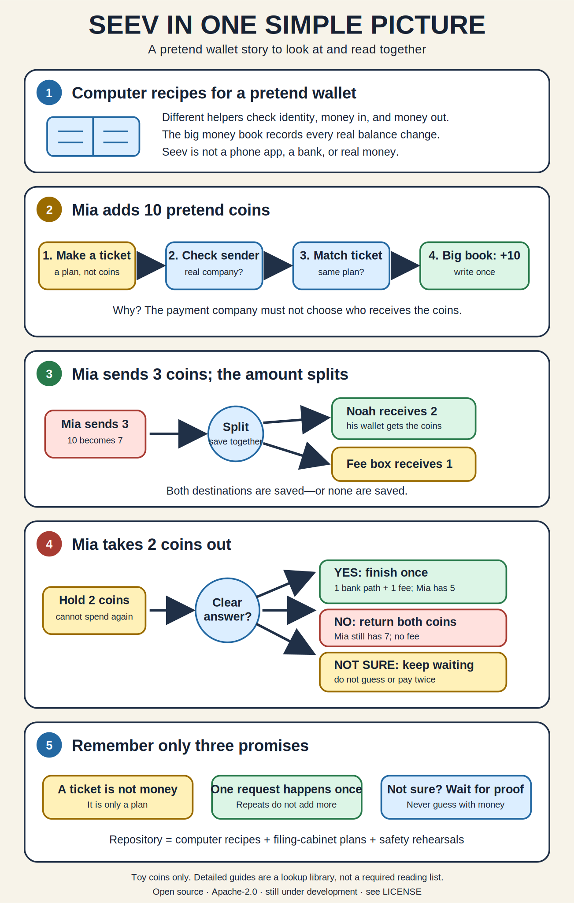

# Seev

> [!IMPORTANT]
> **Open source, still under development.** Seev is licensed under
> [Apache-2.0](LICENSE). The license permits use, modification, distribution,
> and production deployment, but it does not mean the project is
> production-ready, certified, supported, or suitable for real money.

Seev is a learning project that shows how the backend—the part of a digital
wallet that users do not see—can move money safely. There is no mobile app in
this repository. Instead, it contains the services behind one: creating an
account, adding money, sending money, withdrawing money, checking risk,
notifying users, and proving that the recorded balance is correct.

Explore the project through the
[live interactive documentation](https://herdifirdausss.github.io/seev/), or
open [docs/index.html](docs/index.html) locally.

The shortest mental model is a small financial office: one helper checks
identity, one remembers money coming in, one handles money going out, and one
permanent accounting book decides when a balance really changed. Other
helpers check safety, support staff, deliver messages, and find disagreement.

The repository is designed for local learning and engineering validation. The
default credentials and mock vendor integrations are for local development
only; they are not production secrets or real payment integrations.

### What this repository is—and is not

Seev demonstrates service boundaries, double-entry posting,
idempotency, recovery workers, event delivery, fraud seams, operator controls,
and verification under failure. It includes repeatable local journeys and
mock integrations so those ideas can be observed rather than only read about.

Seev is not a mobile wallet, a hosted payment service, a certified banking
system, or a promise that the local configuration is production-safe. A real
deployment still needs real vendor contracts, deployment-specific perimeter
security, regulated operational processes, and independent review.

### Project and publication status

- The repository is an actively evolving learning and engineering reference,
  not a supported financial product or service-level agreement.
- Documents labeled **Current** must match executable behavior. **Target**
  plans are not implementation claims.
- Contributions follow [CONTRIBUTING.md](CONTRIBUTING.md), community behavior
  follows [CODE_OF_CONDUCT.md](CODE_OF_CONDUCT.md), and vulnerabilities follow
  the private process in [SECURITY.md](SECURITY.md).
- The repository is open source under Apache-2.0. Licensing and technical
  readiness are separate: permission to use the code is not a claim that the
  current system is safe for production.

## License

Seev is licensed under the
[Apache License, Version 2.0](LICENSE). Subject to that license, people and
organizations may use, reproduce, modify, and distribute the project,
including for commercial or production purposes.

That legal permission is not a readiness claim. The project is provided
without warranty, and its current local defaults, mock integrations, security
assumptions, and incomplete roadmap make it unsuitable for unreviewed
real-money deployment. Anyone considering production use is responsible for
independent security, compliance, operational, and regulatory assessment.
Third-party dependencies remain subject to their own licenses.

## Start with the interactive story

The [interactive Seev story](docs/index.html) is the main learning path. It
works as one offline HTML file after the repository is cloned or downloaded:
open `docs/index.html` in a browser and select only the chapter you want. Its
208 no-scroll panels show one illustrated idea per screen and require only
Previous, Next, or a quiz answer. A visible story thread carries the reason
from every panel into the next: Mia uses the wallet, Ravi opens and runs the
machine, Nia protects and recovers it, the team proves each claim, and the
reader learns how to contribute. Forty-three prerequisite panels define new
terms before use, so source labels remain optional deeper reading. The six
selectable chapters cover the product journey,
service architecture, every `pkg/` category, local runtime, tests and chaos
drills, observability, security, runbooks, roadmap status, and contribution.
Ten small quizzes explain both correct and incorrect answers; there are no
reading modes or expandable sections.

If interactive HTML is unavailable, use this five-panel static overview. Open
it at full size or read it aloud with a child. The detailed documents are a
reference library, not a required reading list.

The picture uses small toy amounts, not real pricing. Grown-up readers should
also know that the current Payin code has a documented old path that may
continue without a matching top-up ticket; the safer target removes it.

## Choose only one next step

| Your goal | Open only this |
|---|---|
| Choose a chapter and follow the illustrated panels | [Interactive story](docs/index.html) |
| Read with a young child | [Read-aloud story](docs/learn/read-aloud-story.md) |
| Learn independently with no technical background | [Five-minute tour](docs/learn/five-minute-tour.md) |
| Understand the current product end to end | [Fastest product route](docs/README.md#fastest-product-end-to-end-route) |
| Run Seev locally | [Local quick start](#local-quick-start) |
| Change or review Seev | [Fastest engineering route](docs/README.md#fastest-engineering-end-to-end-route) |
| Operate or troubleshoot Seev | [Operations](docs/operations/README.md) |

## Runtime architecture

> **Status: Current.** This table describes code that exists in this
> repository today. Future designs are kept in the
> [plan archive](docs/roadmap/README.md) and are not presented as implemented.

Eight deployable services are built from this repository:

| Service | Container ports (loopback-published locally) | Database | Primary responsibility |
|---|---:|---|---|
| Gateway | 8080, 8081 | seev_gateway | Public API composition, notifications, and ledger event consumption |
| Auth | 8082, 8083 | seev_auth | Registration, login, refresh tokens, profiles, roles, and KYC state |
| Ledger | 8090, 8091, gRPC 9091 | seev_ledger | Double-entry postings, policies, fees, reconciliation, reporting, and workers |
| Pay-in | 8092, gRPC 9092 | seev_payin | Top-up intents, signed vendor webhooks, and routing |
| Payout | 8093, gRPC 9093 | seev_payout | Withdrawal orchestration, vendor commands, recovery, and routing |
| Fraud | 8094, gRPC 9094 | seev_fraud | Synchronous screening rules and asynchronous event enrichment |
| Admin BFF | 8095 | seev_adminbff | Operator sessions, maker/checker console, typed admin proxy, and audit log |
| Assurance | 8096 | seev_assurance | Read-only pay-in/payout/ledger assurance, durable findings, alert delivery, and explicit intake controls |

PostgreSQL stores service-owned data, Redis supports caching, rate limiting,
velocity checks, and distributed coordination, and RabbitMQ carries ledger
events through the transactional outbox flow. Inter-service request paths use
HTTP or gRPC contracts; services must not query another service's database.

## Repository layout

~~~text
.
├── api/proto/               # Protobuf service contracts
├── cmd/                     # Eight service entrypoints plus local utilities
├── deploy/observability/    # Prometheus, Grafana, Loki, Tempo, and Alloy config
├── docs/                    # Documentation home and interactive story
│   ├── learn/               # Plain-language and product learning paths
│   ├── reference/           # Current architecture and technical contracts
│   ├── development/         # Onboarding and contribution rules
│   ├── operations/          # Runtime tooling and incident runbooks
│   ├── security/            # Threat model and trust boundaries
│   └── roadmap/             # Active plans separated from archived history
├── gen/                     # Committed generated protobuf bindings
├── internal/                # Service and domain implementations
├── migrations/              # Per-service SQL migrations
├── pkg/                     # Shared infrastructure packages
├── scripts/                 # CI, smoke, business journey, and chaos tests
├── LICENSE                  # Apache License 2.0
├── docker-compose.yml       # Local infrastructure and opt-in service profiles
└── Makefile                 # Build, migration, verification, and operations targets
~~~

Start from the [documentation home](docs/README.md); it routes each reader to
one category. The most important engineering constraints are documented in
the [Project guide](docs/development/project-guide.md).

## Requirements

- Go 1.25.12 or a compatible newer toolchain
- Docker with Compose
- golang-migrate for direct migration targets
- golangci-lint for make lint
- buf, protoc-gen-go, and protoc-gen-go-grpc when changing protobufs

Install the pinned protobuf tools with:

~~~bash
make tools
~~~

## Local quick start

Create a local environment file and replace the placeholder secrets:

~~~bash
cp .env.example .env
~~~

Start PostgreSQL, Redis, and RabbitMQ:

~~~bash
make docker-up
~~~

Apply every service migration:

~~~bash
make migrate-up-all
~~~

Build and start all eight application containers:

~~~bash
docker compose --profile app up --build -d
~~~

Useful local endpoints:

- Gateway API: http://127.0.0.1:8080
- Gateway health and metrics: http://127.0.0.1:8081
- RabbitMQ management: http://127.0.0.1:15672
- PostgreSQL host port: 5433
- Redis host port: 6380

Stop the stack with:

~~~bash
docker compose --profile app down
~~~

The Compose defaults are intentionally convenient for local development.
Before using any non-local environment, set strong values for JWT_SECRET,
INTERNAL_GRPC_TOKEN, database credentials, broker credentials, vendor
secrets, and TLS-related settings.

## Build and verification

~~~bash
make build-all       # build all eight deployable services
make test            # unit tests with race detection and coverage
make vet             # static checks from the Go toolchain
make lint            # golangci-lint
make docs-check      # local Markdown links and heading anchors
make proto-lint      # protobuf lint
git diff --check     # whitespace validation
~~~

Integration tests use build tags and require Docker:

~~~bash
go test -tags=integration -race ./...
~~~

Operational verification:

~~~bash
./scripts/smoke-test.sh
./scripts/business-e2e.sh
./scripts/admin-e2e.sh
./scripts/chaos-test.sh all
make smoke-container
~~~

`make verify-full` runs the complete repository gate from clean Docker volumes.
It is intentionally heavier than the normal unit-test loop.

## Protobuf workflow

Generated Go bindings under gen/ are committed:

~~~bash
make proto
make proto-lint
make proto-breaking
~~~

Run the breaking-change check from a branch that can resolve the local main
reference.

## Observability

The optional observability profile contains Prometheus, Grafana, Loki, Tempo,
Alloy, and a restricted Docker socket proxy:

~~~bash
make observability-up
make observability-down
~~~

The first command creates a local, ignored Grafana admin secret when needed.
Do not run the observability profile alongside the full testcontainers suite
on a memory-constrained Docker installation.

## Security and financial invariants

- Ledger entries are append-only; corrections use compensating transactions.
- Monetary values use decimal or integer minor-unit representations, never
  binary floating point.
- Every posting is balanced and requires an idempotency key.
- Application and migration database identities are separate.
- Service databases are private to their owning service.
- Public logs mask credentials and avoid full idempotency keys.
- Container ports are bound to loopback in the local Compose configuration.

See [Project guide](docs/development/project-guide.md) before changing transaction ordering,
service boundaries, security controls, or verification scripts.

## Documentation

The [documentation index](docs/README.md) is the main chooser. You do not need
to read every document.

- **Learn the product:** [read-aloud story](docs/learn/read-aloud-story.md),
  [five-minute tour](docs/learn/five-minute-tour.md),
  [visual story](docs/learn/visual-story.md),
  [beginner guide](docs/learn/beginner-guide.md),
  [product tour](docs/learn/product-tour.md), [rationale](docs/reference/rationale.md), and
  [glossary](docs/reference/glossary.md).
- **Understand and change the code:** [architecture](docs/reference/architecture.md),
  [services](docs/reference/services.md), [onboarding](docs/development/onboarding.md),
  [shared packages](docs/reference/shared-packages.md), [project rules](docs/development/project-guide.md), and
  [concept-to-code evidence](docs/reference/traceability.md).
- **Operate and review it:** [operational tooling](docs/operations/README.md),
  [runbooks](docs/operations/runbooks/), [threat model](docs/security/threat-model.md),
  [event contract](docs/reference/events.md), and
  [scheduler guide](pkg/scheduler/README.md).
- **Understand project history:** [plan index](docs/roadmap/README.md) separates
  completed, future, reference, and superseded plans.
- **Participate safely:** [contributing guide](CONTRIBUTING.md),
  [code of conduct](CODE_OF_CONDUCT.md), [security policy](SECURITY.md), and
  [documentation style](docs/development/documentation-style.md).
