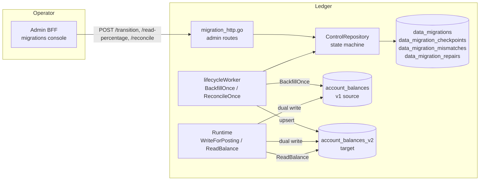
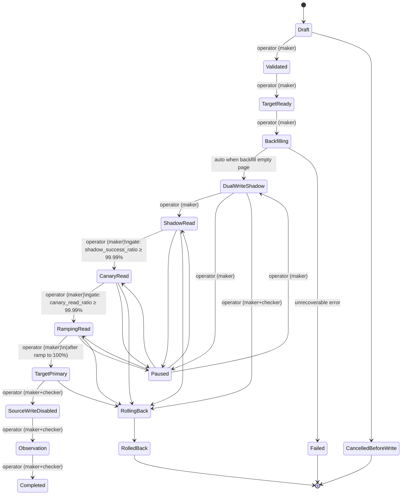
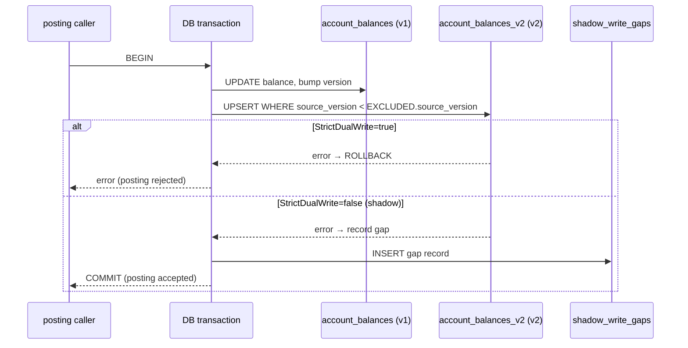
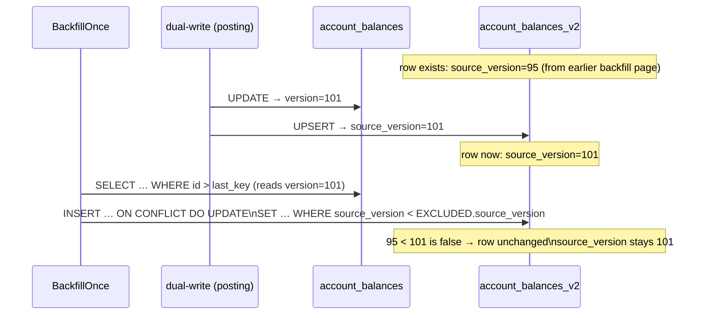
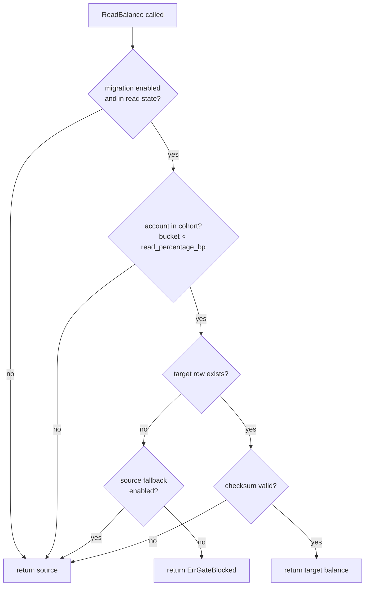
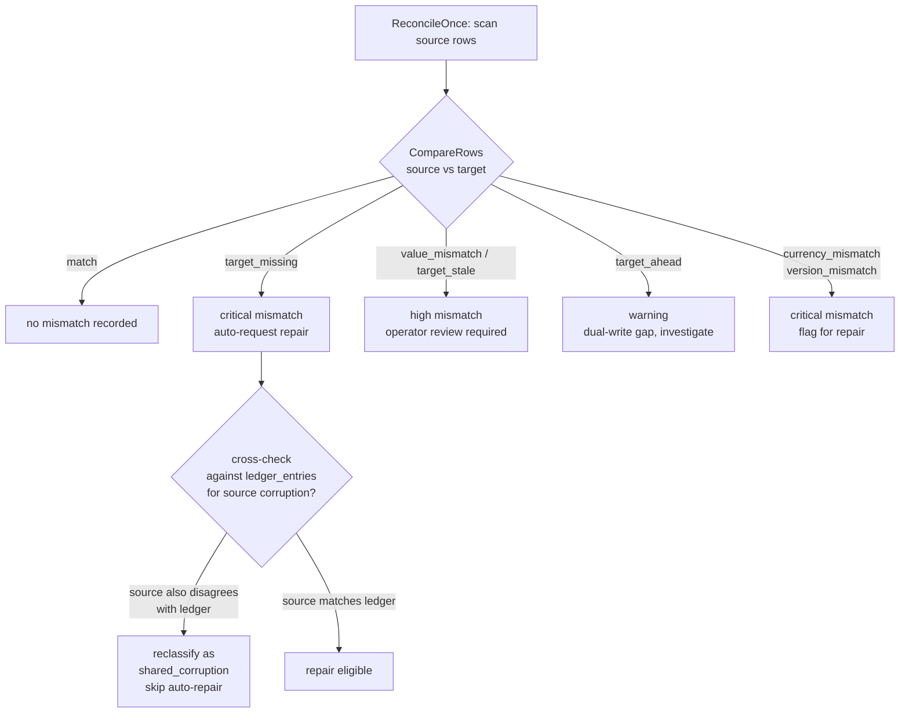
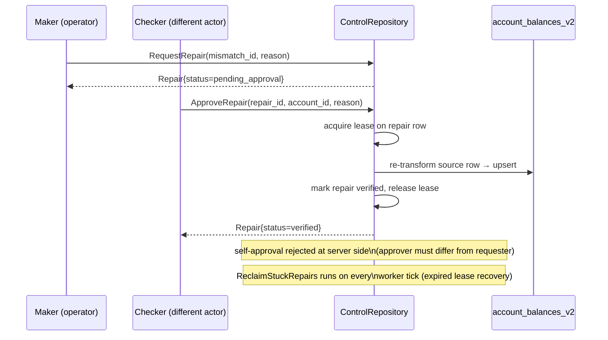

# C6 zero-downtime data migration platform

C6 is the internal framework for migrating data between storage projections
without a maintenance window, a read outage, or a financial safety regression.
The Ledger's `account_balances` → `account_balances_v2` migration is the
reference implementation; the platform packages
(`internal/platform/migration/*`) are generic and can drive any service's
projection migration.

## Boundary

The migration control plane lives entirely inside the service that owns the
data. The Admin BFF proxies operator requests through to the Ledger's internal
admin router; no migration logic runs in the BFF. External callers never see
the target table directly until the cutover is complete.

## State machine

The migration advances through 17 named states. Forward transitions are
operator-driven (maker/checker) or automatic (backfill completion). Only one
migration per name may be active at a time; the lifecycle-machine is
deliberately not generalized to a multi-migration pipeline.

Dangerous transitions — `SourceWriteDisabled`, `Observation`, `Completed`,
`RollingBack`, and any read-percentage increase above 2500 bp (25%) — require
a second distinct actor (`approve: true` in the request body with checker
privileges). Self-approval is rejected at the server-side `ControlRepository`.

## Live dual write

During `Backfilling`, `DualWriteShadow`, and all shadow/read states, every
posting transaction writes both projections inside the same database
transaction. Failure mode is controlled by `StrictDualWrite`:

- **Shadow mode** (`StrictDualWrite=false`): target write failure is absorbed
  and recorded as a shadow-write gap; the posting succeeds.
- **Strict mode** (`StrictDualWrite=true`, automatically set at `ShadowRead`):
  target write failure rolls back the whole posting transaction.

## Backfill / live-write race prevention

The backfill keyset scan and the live dual-write path can operate
concurrently. A live posting may have advanced the target row's
`source_version` beyond what the backfill scan is currently processing. The
version-safe upsert prevents the backfill from overwriting a newer live row:

The `WHERE source_version < EXCLUDED.source_version` clause in the upsert is
the sole guard. It is covered by `TestBackfillOnce_VersionSafeUpsert`.

## Read ramp and instant rollback

`ReadBalance` uses a stable SHA-256 cohort hash to assign each account to a
bucket (0–9999 bp). An account is served from the target only if its bucket
falls within `read_percentage_basis_points`. Setting the percentage to 0
immediately removes all accounts from the target cohort with no redeploy.

The `read_percentage_basis_points` column can be updated independently of the
state transition, via `POST /admin/migrations/{id}/read-percentage`. Reducing
it to 0 is a one-second, one-API-call instant rollback. This is the primary
safety escape hatch for any production anomaly detected post-cutover.

## Target-primary fallback chain

At `TargetPrimary`, `SourceFallbackEnabled=true` (set at `TargetReady`)
means every read failure silently falls back to the source. The fallback codes
are logged as structured events for post-analysis:

| Reason | Fallback? | Logged event |
|---|---|---|
| Not in cohort (0% ramp) | — | no event |
| Target row missing | yes (if fallback enabled) | `target_missing` |
| Checksum mismatch | yes (if fallback enabled) | `checksum_mismatch` |
| Target read error | yes (if fallback enabled) | `target_read_error` |
| Account not in cohort (partial ramp) | — | no event |

At `SourceWriteDisabled` the fallback is disabled server-side; errors surface
to callers rather than silently serving stale data.

## Three-layer reconciliation

`ReconcileOnce` compares each source row against the target using the
`CompareRows` classifier:

Mismatches are never silently dropped. A critical mismatch (`target_missing`,
`currency_mismatch`) automatically aborts the read path to source, regardless
of `read_percentage_basis_points`, until the repair is verified.

## Repair lifecycle

## Control schema (abridged)

| Table | Purpose |
|---|---|
| `data_migrations` | one row per named migration; holds state, version, read %, flags |
| `data_migration_checkpoints` | keyset position + lease for each backfill/reconcile worker |
| `data_migration_mismatches` | classified reconciliation findings |
| `data_migration_repairs` | maker/checker repair lifecycle with lease columns |
| `data_migration_read_events` | immutable audit log of every read served from target |
| `shadow_write_gaps` | shadow-mode target write failures, for post-analysis |
| `data_migration_gates` | snapshot of each gate at the time of a state transition |
