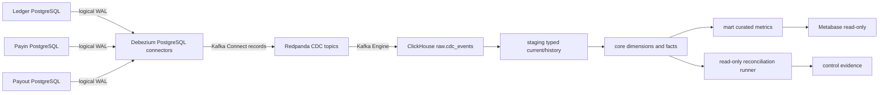
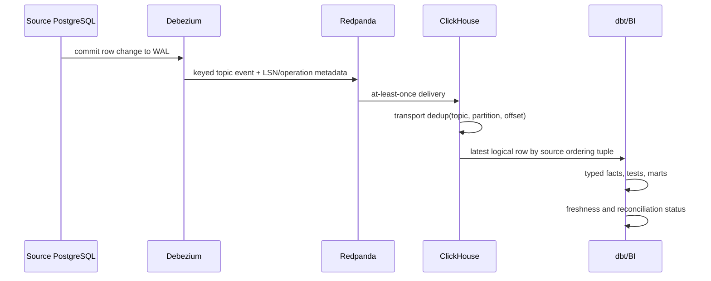

# C2 analytical data platform

C2 is a removable, read-only projection. LedgerService remains the source of
truth for money; PayinService and PayoutService remain owners of their own
lifecycle state. No application service or money-movement transaction depends
on C2 availability.

## One-way boundary

RabbitMQ remains the operational/domain-event bus. Redpanda is used only for
CDC transport and replay. There is no reverse arrow to PostgreSQL.

## Ordering and recovery

If Connect, Redpanda, or ClickHouse fails, source transactions continue. The
failure creates lag and possibly retained WAL; it does not create an OLTP
dependency. Restart uses stored offsets and the warehouse deduplication key.

## Financial semantics

- `ledger_entries` is immutable and is the financial fact source.
- Debit/credit equality is tested per transaction and period.
- Fee revenue is net movement in approved Ledger fee accounts, using posted
  entries only. Fee quotes and GPV never prove revenue.
- All money stays integer minor units and is grouped by currency.
- Business report dates are derived in `Asia/Jakarta`; source timestamps stay
  UTC.
- Vendor cost and contribution margin are explicitly modeled and versioned,
  not actual profitability.

## Source ownership and privacy

The allowlist in [analytics/contracts/sources.yaml](../../analytics/contracts/sources.yaml)
is the source contract. The Connect SMT removes approved identity fields and
replaces them with deterministic HMAC pseudonyms before topic publication.
Raw payloads, payout destinations, credentials, KYC fields, and raw callback
bodies are not captured. The correlation rules are in
[analytics/contracts/correlation-matrix.md](../../analytics/contracts/correlation-matrix.md).

Existing Ledger reporting and compliance views remain authoritative for their
existing purpose. C2 does not replace balances, statements, regulatory views,
settlement evidence, or authorization reads.
