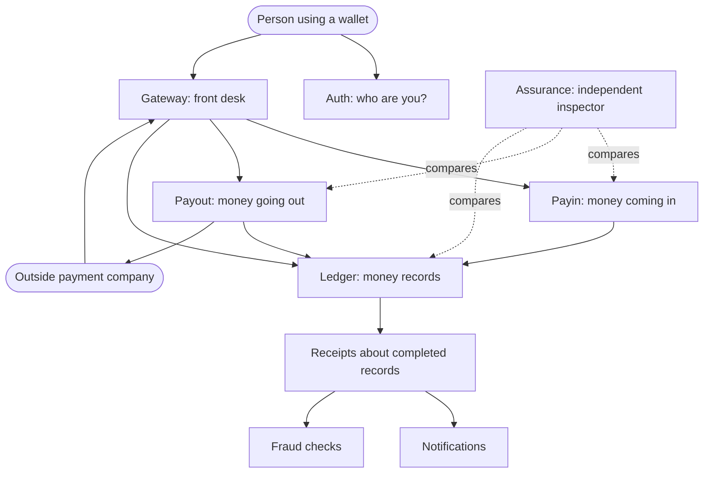
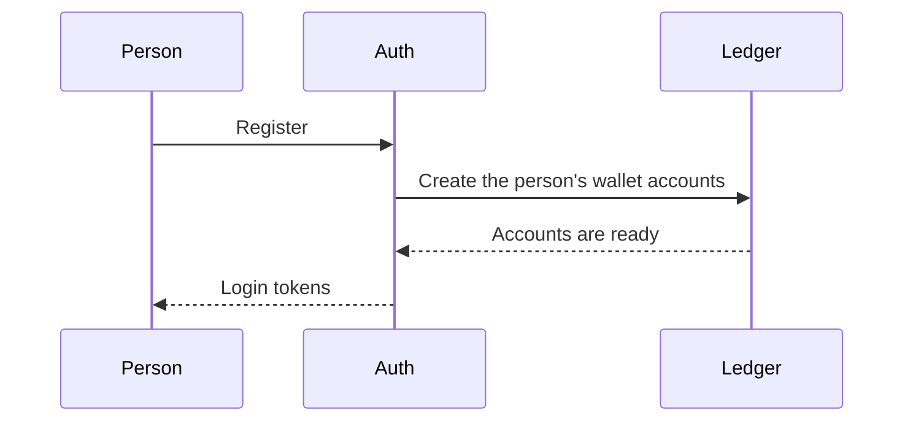
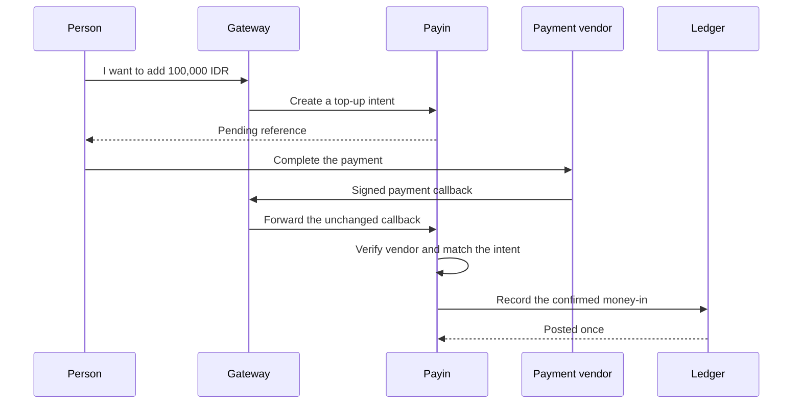
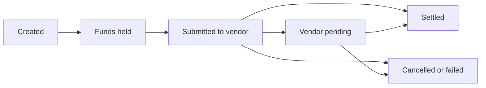

# Seev, Explained from Start to Finish

> [Documentation home](../README.md) · [Learn](README.md)

**Status: Current.** This guide describes the software that exists in this
repository today. You do not need to know programming, banking, or accounting
before reading it.

For the quickest explanation, start with
[Seev in five minutes](five-minute-tour.md). If you prefer more diagrams and a
single story before this longer guide, continue with
[Seev as a visual story](visual-story.md).

## The shortest explanation

Seev is the behind-the-scenes part of a practice digital wallet. It does not
draw the buttons on a phone. It receives requests from an app and makes sure
that every change to money is authorized, recorded once, and possible to
explain later.

The project uses fake payment vendors and local development credentials. It is
an educational reference, not a bank and not a production-ready payment
product.

## Read this story before learning any system names

Mia installs a wallet app. Her balance starts at zero.

1. **Mia creates an account.** The system checks who she is and creates an
   empty place where her money history will be recorded.
2. **Mia adds 100,000 IDR.** First, the system writes down her plan to add
   money. Her balance does not change yet.
3. **Mia pays through an outside payment company.** That company reports the
   successful payment. The system checks that the report is genuine and that
   it matches Mia's earlier plan.
4. **The accounting book records the money.** Only now does Mia's wallet
   contain 100,000 IDR.
5. **Mia sends 25,000 IDR to Noah.** In this example, a previously quoted fee
   is 500 IDR. The accounting book records 25,000 leaving Mia, 24,500 entering
   Noah, and 500 entering the platform fee account. Mia has 75,000 left.
6. **Mia withdraws 20,000 IDR.** The system first reserves that amount. It asks
   an outside payout company to send the money. If the company confirms
   success, 18,000 goes to the settlement path, 2,000 goes to the platform fee
   account, and Mia has 55,000 left. If it confirms failure, the full 20,000
   reservation is released and no withdrawal fee is charged.
7. **Independent checks continue afterward.** Notifications tell Mia what
   happened. A safety component looks for risky patterns. An inspector
   compares the different records and reports disagreements.

This is the complete story the repository demonstrates. Its known current
limitations are called out beside the relevant steps instead of being hidden.
The rest of this guide gives each participant its real name and explains why
it is separate.

## Five ideas that make the story safe

### A plan is not the same as a fact

“Mia wants to add money” is a plan. “The accounting book recorded the money”
is a fact. Seev keeps those states separate so a half-finished payment cannot
look complete.

The technical name for the first plan is a **top-up intent**. The technical
name for the final accounting fact is a **posted Ledger transaction**.

### The same message may arrive more than once

A phone, network, or payment company may retry because it did not receive an
answer. Seev gives one intended operation a stable key. Repeating that key
must return or continue the first operation, not create a second payment.

The technical name for this property is **idempotency**.

### History must not be secretly rewritten

If an accounting mistake is found, Seev adds a new correction that points back
to the old record. It does not erase the old record. This allows a person to
reconstruct what happened and why the balance changed.

The technical names are **append-only history** and a **compensating
transaction**.

### An outside message is evidence, not permission

A payment company's message must be authenticated and matched against Seev's
own records. The vendor must not be allowed to choose a Seev user merely by
putting a user identifier in its message.

The technical names are a **signed callback** and **intent correlation**.

### Uncertainty must remain visible

If a payout company times out, Seev does not know whether the company accepted
the withdrawal. Trying another payout immediately could pay twice. The request
stays pending while recovery checks for authoritative evidence.

The technical name is an **uncertain state** in a **state machine**.

## Why this project exists

Moving a number on a screen is easy. Moving money safely is difficult.
Networks retry requests, computers stop halfway through work, outside payment
companies send the same message twice, and two actions can happen at nearly
the same time. A safe wallet must still answer these questions:

- Did the person prove who they are?
- Was this exact request already completed?
- Is there enough money?
- Did the outside payment company really send this message?
- Did both sides of the accounting record get written?
- Can an operator or auditor explain what happened later?

Seev exists to demonstrate how those questions can be answered together.

## Meet the parts of the system

Imagine a financial office with several desks. Each desk has one job and keeps
its own files.

| Seev name | Everyday analogy | What it is responsible for |
|---|---|---|
| Gateway | Front desk | Receives wallet requests and sends them to the correct internal desk |
| Auth | Identity desk | Registration, login, identity checks, and permissions |
| Payin | Money-in cashier | Creates and verifies plans to add money |
| Payout | Money-out cashier | Coordinates withdrawals and their safe completion or cancellation |
| Ledger | Permanent accounting book | Records every real balance change using balanced entries |
| Fraud | Safety officer | Screens actions and identity data for known risk rules |
| Admin BFF | Operator workspace | Gives authorized staff controlled tools and records their actions |
| Assurance | Independent inspector | Compares records from different desks and reports disagreements |

PostgreSQL is the filing cabinet used by each desk. Every service gets a
separate database and must ask through an API instead of opening another
service's files. Redis stores short-lived coordination data. RabbitMQ is a
mailroom for events that other parts of the system can process later.

You do not need these technology names to understand the product:

| Simple idea | Technology used here |
|---|---|
| A service's private filing cabinet | PostgreSQL database |
| A short-lived shared note or counter | Redis |
| A mailroom that can retry delivery | RabbitMQ |
| A defined request between programs | HTTP or gRPC API |
| A separately started part of the system | Service process or container |

## One picture of the current system

The solid arrows show requests or messages. The dotted arrows show Assurance
reading and comparing facts; Assurance cannot move money. The vendor-to-
Gateway arrow is current behavior and is planned to move to VendorService.

## Three kinds of truth

Several services may talk about one payment, but they do not own the same
facts:

| Question | Authoritative owner |
|---|---|
| Who is the user and which identity checks passed? | Auth |
| Which top-up or withdrawal is being processed? | Payin or Payout |
| Did the wallet balance really change? | Ledger |
| Was a user notification delivered? | Gateway's notification component |
| Do records from different services disagree? | Assurance records the finding; it does not replace the original owners |

A notification, log line, or vendor message is not the source of truth for a
wallet balance. This ownership rule is why services must communicate through
defined contracts instead of directly changing another service's files.

The words shown to a user must follow the same rule. “Request received,”
“money reserved,” and “complete” are different promises. The
[visual story's user-message table](visual-story.md#what-mia-may-safely-be-told)
shows which durable evidence supports each message.

## Why not put everything in one program?

One program would be easier to start and debug. Separate services add network
calls, certificates, deployment work, and more ways for communication to fail.
Seev therefore began as one modular program and separated services only when
there was a reason: independent ownership, different scaling, security or data
isolation, deployment independence, or limiting the damage from one failure.

The lesson is not “more services are always better.” The lesson is to keep
clear business boundaries first, then choose deployment boundaries when the
benefit justifies the cost.

## The most important rule

The number shown as a balance is not changed directly. A money movement must
first be written to the Ledger as a balanced accounting transaction.

If Alice sends 10 units to Bob, Seev records both facts:

1. 10 units leave Alice's account.
2. 10 units enter Bob's account.

The two sides must be equal. This is called
[double-entry accounting](../reference/glossary.md#double-entry-accounting). Keeping an
append-only history means Seev corrects mistakes with a new compensating
record instead of secretly rewriting the past.

## Story 1: creating an account

1. A person registers with Auth.
2. Auth stores the identity and asks Ledger to create the required wallet
   accounts.
3. Ledger creates the accounting structure; it does not add free money.
4. Auth returns tokens that prove who is making later requests.

Why separate Auth and Ledger? A password or identity document is not an
accounting entry. Each service protects a different kind of sensitive data.

## Story 2: adding money with a top-up

A top-up intent is a plan, not money. It says who expects to add how much, in
which currency, through which vendor, and under which reference.

Today, the vendor sends a signed callback to Gateway. Gateway forwards the
unchanged bytes to Payin. Payin verifies the signature, tries to match the
reference to an intent, checks the amount and currency, screens the action,
and asks Ledger to post the money. The Ledger's idempotency check prevents a
repeated callback from creating money twice.

Why keep the intent in Payin? The outside vendor should not decide which Seev
user owns the money. That relationship belongs to Seev's money-in domain.

> **Known current limitation:** the present code still contains an old
> compatibility path that can use a vendor payload's `user_id` when no top-up
> intent is found, and it does not yet enforce the complete dedicated-service
> boundary described above. This is documented openly because it is not the
> desired safety model. Plan 54 removes that fallback and requires strict
> owner-domain correlation before money or notifications can change.

> A future design moves all direct vendor communication behind a dedicated
> VendorService. It is documented as a target in
> [plan 54](../roadmap/active/54-vendor-service-boundary.md), not as current behavior.

## Story 3: sending money to another user

1. The sender gives Gateway an authenticated transfer request.
2. Fraud and policy checks decide whether it may continue.
3. Ledger locks the relevant accounts in a stable order, verifies the balance,
   and writes every side of the transfer in one database transaction. With the
   example 500 IDR fee, it records 25,000 leaving Mia, 24,500 entering Noah,
   and 500 entering the platform fee account.
4. Retrying the same request with the same idempotency key returns the first
   result instead of paying twice.
5. An outbox worker later sends an event through RabbitMQ. Notifications and
   post-transaction fraud analysis can react independently.

Why publish the event later? The balance must not depend on a notification
service or message broker being available at that exact moment.

The 25,000 IDR is the total amount Mia authorizes. The fee is deducted from
that amount; it is not an extra debit. Actual fees are configurable, so the
numbers above are a teaching example rather than a pricing promise.

## Story 4: withdrawing money

Payout first places a hold so the same funds cannot be spent elsewhere. A
durable command worker submits the withdrawal to the selected vendor. A
successful result closes the hold by settling it; a confirmed failure closes
the hold by cancelling it. Recovery workers can continue safely after a
crash.

Why not immediately subtract the money? An outside vendor may time out after
accepting a request. The state machine preserves the uncertainty instead of
guessing and accidentally paying twice.

## What happens when something breaks?

| Failure | Safe behavior |
|---|---|
| The same request arrives twice | Idempotency returns or continues the original operation |
| A callback has a bad signature | Reject it before moving money |
| A process stops after saving work | A durable worker resumes from stored state |
| RabbitMQ is unavailable | Ledger posting remains saved; the outbox retries delivery |
| A withdrawal result is uncertain | Keep it pending and query/recover; do not try another vendor blindly |
| Service records disagree | Assurance creates a finding for operators |
| An accounting mistake is confirmed | Add a compensating transaction; never rewrite ledger history |

Different dependencies deliberately have different failure policies. For
example, a system may continue when optional tracing is unavailable, but it
must stop when it cannot perform a required safety check. The technical
documents name each policy explicitly as fail-open or fail-closed.

## Current system and future ideas

The current system has eight deployable services. Documents marked
**Current** must agree with executable code and tests. Documents marked
**Target** describe a design that still needs implementation. Files under
`docs/roadmap` are a chronological decision history; an old plan can be useful
without describing today's system.

This distinction matters. A public repository should never make a future
security control look as if it already protects running code.

## How the story appears in the repository

You can understand the main folders without reading Go code:

| Folder or file | Plain-language meaning |
|---|---|
| `cmd/` | The switches that start each service or one-time utility |
| `internal/` | The business decisions and service implementations |
| `api/proto/` | Written agreements for typed internal requests |
| `migrations/` | Instructions that create or change each service's filing cabinet |
| `pkg/` | Reusable plumbing that does not decide wallet business rules |
| `scripts/` | Repeatable rehearsals that prove important journeys and failures |
| `deploy/` | Local monitoring and deployment-related configuration |
| `docs/roadmap/` | The dated history of decisions and future implementation plans |
| `docker-compose.yml` | Instructions for starting the local collection of services |

The name `internal` does not mean “secret data.” In Go, it means code that is
private to this repository and cannot be imported freely by outside projects.

## Common questions

### Is Seev a usable wallet application?

No. It is a backend reference and learning project. It has APIs and an
operator interface, but it does not include a customer mobile application or
real payment-company contracts.

### Does it move real money?

No. The included vendor integrations are mocks for local testing. Monetary
values still follow strict accounting rules so the same design can be studied
realistically.

### Why are there so many tests and failure drills?

A successful demonstration proves only the happy path. Money software must
also prove what happens during retries, crashes, dependency outages,
concurrent requests, and delayed messages. The scripts deliberately rehearse
those situations.

### Why can a notification arrive later?

Recording money is more important than sending a message. Ledger first stores
the accounting result and a durable event record. A worker can deliver the
notification later if the message system was temporarily unavailable.

### Why does each service have its own database?

Private databases make ownership explicit. Payin cannot silently edit Ledger
balances, and Assurance cannot repair a transaction behind the owner's back.
The cost is that services need APIs, retries, and reconciliation when their
records describe different parts of the same journey.

### Is the repository production-ready?

No. Seev is open source under [Apache-2.0](../../LICENSE), so the license
permits production use, but permission is not proof of safety. Its local
defaults, mock vendors, local certificate authority, deployment topology, and
regulatory assumptions are intentionally incomplete. A real-money deployment
would need independent engineering, security, compliance, operational, and
regulatory review.

### Which document should I trust when two documents disagree?

For current behavior, executable code and tests come first, followed by the
current-state documents. The plan index decides whether a plan is completed,
future, reference, or superseded. Historical plans explain past reasoning but
do not override the running system.

## Choose your next step

- Read the [Product tour](product-tour.md) to connect KYC, fee quotes,
  operators, reconciliation, assurance, and recovery to the four stories here.
- Read [Why Seev works this way](../reference/rationale.md) for a searchable explanation of each
  decision's benefit, prevented risk, and cost.
- Read [Architecture](../reference/architecture.md) to understand the reasons behind
  the design.
- Read [Services](../reference/services.md) to learn exactly what each service owns.
- Follow [Onboarding](../development/onboarding.md) to trace the implementation in code.
- Use the [Glossary](../reference/glossary.md) whenever a word is unfamiliar.
- Use [Operations](../operations/README.md) and the [runbooks](../operations/runbooks/README.md) to
  run or troubleshoot the project.
