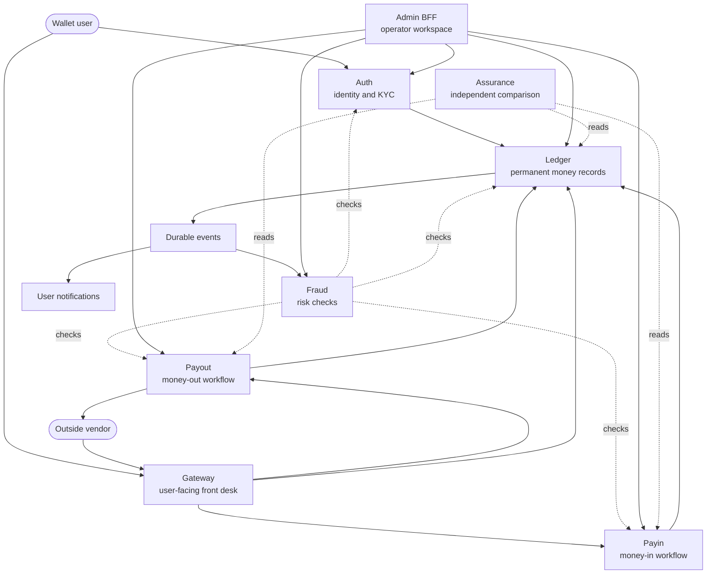

# Seev Product Tour

> [Documentation home](../README.md) · [Learn](README.md)

> **Status: Current. Audience: curious readers, product people, new engineers,
> and reviewers.** This is the bridge between the
> [visual story](visual-story.md), [beginner guide](beginner-guide.md), and the detailed
> [architecture](../reference/architecture.md).

For a question-by-question explanation of tradeoffs, use
[Why Seev works this way](../reference/rationale.md).

## What this tour will answer

By the end, you should be able to explain:

- what a user is trying to do;
- which part of Seev owns each decision;
- when money is only planned, reserved, or final;
- why retries and failures do not automatically duplicate money;
- how fees, risk checks, operators, and outside vendors fit in;
- how Seev detects disagreement after the original request finishes; and
- which claims are current code versus future design.

You do not need to memorize service names. Follow the user story first, then
use the service names as labels for responsibilities you already understand.

## The whole product in one picture



Solid arrows represent requests or messages. Dotted arrows represent checking
or read-only comparison. The vendor callback currently enters through Gateway;
[plan 54](../roadmap/active/54-vendor-service-boundary.md) proposes a dedicated
VendorService instead.

## One map of every journey

Every workflow can be understood by asking five questions:

1. What starts it?
2. Which service owns the decision?
3. What durable evidence is saved?
4. What makes it complete?
5. Why is completion defined that way?

The table answers those questions without requiring knowledge of APIs or
databases. “Durable” means the evidence remains after a process restarts.

| Journey | What starts it? | Owner | Durable evidence | When is it complete? | Why? |
|---|---|---|---|---|---|
| Registration | A person creates an account | Auth | User record; empty Ledger accounts | Identity and accounting structure are ready | Login data and money records have different owners |
| KYC upgrade | A person submits identity evidence | Auth | KYC attempt and retry state | Ledger applies the new limits before Auth issues the higher claim | A token must not promise permission that Ledger will reject |
| Fee quote | A client asks for an exact price | Ledger | Quote with amount, currency, fee, owner, and expiry | The matching posting consumes it once | The shown price must not silently change |
| Top-up | A person asks to add money | Payin | Pending intent linked to user, amount, currency, and vendor | Ledger posts the confirmation once; a legacy path may currently proceed without an intent, and Payin finalization may lag | The safe target requires the internal intent—not the vendor—to choose the wallet owner |
| Transfer | A person sends money to another user | Ledger | One balanced transaction and its outbox event | Sender, receiver, and fee entries commit together | Nobody should lose money while another side is missing |
| Withdrawal | A person asks to send wallet value outside | Payout | Payout request, Ledger hold, and durable vendor command | The hold is settled after confirmed success or cancelled after confirmed failure | A timeout is not proof of failure and must not cause a second payout |
| Notification | A committed event becomes available | Gateway notification component | Outbox event and delivery record | Delivery is recorded; retries remain safe | Message delivery must not control whether money is real |
| Operator action | An authorized operator proposes work | The affected domain | Proposal, approval decision, and audit evidence | The owning service accepts a valid action; sensitive changes require another operator | The interface alone must not be able to bypass business authorization |
| Reconciliation | An external settlement report arrives | Ledger reconciliation | Batch, matched items, differences, and resolutions | Every item has an explained outcome | Balanced internal records do not prove a bank moved the same value |
| Assurance | Scheduled comparison finds agreement or a mismatch | Assurance | Comparison cursor and durable finding | Evidence supports resolution; a later mismatch can reopen it | The inspector must report disagreement without rewriting owner data |

Some journeys have two related completion facts. For example, Ledger can make
a top-up balance real before Payin has saved its own final workflow state. That
is a visible current limitation, not permission to describe the whole product
journey as complete. The safer target emits user-facing completion only after
the owning Payin or Payout state is durable.

This distinction is the heart of the system: the workflow owner answers “what
happened to this request?”, while Ledger answers “what happened to money?”
Both facts matter, but neither service may invent the other's answer.

## A worked example with visible balances

This example uses small, illustrative fees so every destination of the money
is visible. Amounts are minor units of IDR: `100000` means IDR 100,000.

Mia and Noah both have verified wallet accounts. Mia starts with no money.

| Step | Mia's wallet | Noah's wallet | Platform fee account | What became final? |
|---|---:|---:|---:|---|
| Start | 0 | 0 | 0 | Accounts exist, but no money moved |
| Mia tops up 100,000 | 100,000 | 0 | 0 | Ledger posts the confirmed money-in |
| Mia transfers 25,000 with a 500 fee | 75,000 | 24,500 | 500 | One balanced posting splits the requested amount |
| Mia withdraws 20,000 with a 2,000 fee | 55,000 | 24,500 | 2,500 | 18,000 goes to the settlement rail and 2,000 becomes fee revenue |

Nothing disappeared or appeared inside the example:

```text
Mia 55,000 + Noah 24,500 + fees 2,500 + settlement 18,000 = 100,000
```

That equality is the purpose of balanced accounting. A displayed balance can
change, but the records must still explain where every unit came from and
where it went.

During the withdrawal, Mia's 20,000 first moves from available cash to a hold.
That reservation prevents her from spending it twice while Payout waits for
the vendor. If the payout is cancelled, the full 20,000 returns and no payout
fee is charged. If it settles, Ledger moves 18,000 to the selected settlement
account and 2,000 to the platform fee account.

The example is deliberately a model, not a promise about real-world pricing.
Actual local fees come from database-configured rules or a stored fee quote.

## Journey 1: identity, login, and KYC

### What the person experiences

The person registers, logs in, submits identity information, and receives a
verification level. Higher levels can unlock larger limits.

### What Seev does

1. Auth stores the person's identity and credentials.
2. Ledger creates empty financial accounts for the new user.
3. Auth sends KYC data through the configured verification and sanctions
   checks.
4. An approval first applies the new policy limits in Ledger.
5. Only after that succeeds does Auth expose the higher KYC level in new login
   tokens.

### Why the order matters

If Auth announced a higher level before Ledger applied its limits, the user
could hold a token claiming more permission than the money policy recognizes.
The implementation is therefore “limits first, claim second.” Durable retry
work preserves an approval if the cross-service update fails temporarily.

### Source of truth

Auth owns identity and KYC status. Ledger owns the limits it enforces while
posting money. Neither service reads the other's database.

## Journey 2: asking for an exact fee

### What the person experiences

Before a transfer or withdrawal, the client can request a fee quote. The quote
states the transaction kind, amount, currency, user, fee, and expiry.

### Why a quote exists

A fee rule can change between showing a price and submitting the transaction.
Without a stored quote, the system might silently charge a different fee.
Seev consumes the exact quote once, rejects a changed amount or currency, and
rejects reuse after successful consumption.

### Source of truth

Ledger owns fee rules and fee quotes because fees become accounting entries in
the same posting as the money movement.

## Journey 3: adding money

### What the person experiences

The person asks for a top-up, receives a pending reference, pays through an
outside vendor, then waits for confirmation.

### What Seev does today

1. Gateway authenticates the person and asks Payin to create an intent.
2. Payin selects an enabled vendor route and stores the pending intent.
3. The vendor sends a signed callback to Gateway.
4. Gateway preserves the callback body and headers and forwards them to Payin.
5. Payin verifies the vendor signature, interprets the event, checks the
   expected amount and currency when an intent is found, and screens it.
6. Payin asks Ledger to post `money_in` with a stable idempotency reference.
7. Ledger writes balanced entries and a durable event in one database
   transaction.

### Why an intent exists

The intent connects an external reference to Seev's own user, amount,
currency, and expected vendor. A callback should confirm that expectation; it
should not invent ownership.

### Known current limitation

Current Payin still has a legacy path that may use `user_id` from a verified
vendor payload when no intent matches, and local finalization can lag behind a
successful Ledger post. These are documented gaps, not the desired trust
model. Plan 54 removes the fallback, requires strict owner-domain correlation,
and delays user notification until Payin's final state is durable.

### Source of truth

Payin owns the top-up workflow. Ledger owns the resulting balance change.

## Journey 4: transferring money to another user

### What the person experiences

Mia chooses Noah, an amount, and optionally a fee quote. One request should
either complete once or fail without a partial balance change.

### What Seev does

1. Gateway checks the user token and KYC gate.
2. Ledger's public transport performs the required risk check before opening
   the posting database transaction.
3. Ledger validates the idempotency key, transaction kind, amount, currency,
   limits, account status, and available balance.
4. It locks accounts in a stable order so concurrent transfers cannot create
   a deadlock or overspend the same balance.
5. It writes the sender debit, receiver credit, optional fee credit, balance
   projections, and outbox event atomically.

### Why it is one Ledger transaction

Mia must never lose money without Noah or the fee account receiving the
matching amount. “All writes commit or all writes roll back” protects that
rule.

### Source of truth

Ledger owns the complete transfer and balances. Gateway only presents the API.

## Journey 5: withdrawing money

### What the person experiences

The person requests a withdrawal to a destination such as a bank account. The
request can be submitted, pending, settled, failed, or cancelled.

### What Seev does

1. Payout validates the request, route, KYC/policy conditions, and screening.
2. Ledger moves the requested amount from available cash to a hold.
3. Payout stores a durable vendor command before network dispatch.
4. A worker calls the selected vendor with the payout request id as its
   idempotency key.
5. A confirmed success settles the hold. A confirmed terminal failure cancels
   it. A timeout remains uncertain and pinned to the same vendor.
6. Recovery workers resume stored work after a process crash.

### Why failover is limited

Payout can choose another vendor only before there is evidence that the first
vendor may have accepted the request. After an uncertain network result,
trying a second vendor could pay twice.

### Source of truth

Payout owns the workflow and selected vendor. Ledger owns the hold and final
settlement or cancellation entries.

## Journey 6: events and notifications

Ledger stores an outbox row in the same database transaction as a posting. A
relay later publishes the event to RabbitMQ. Gateway's notification component
and Fraud can consume the same fact independently.

This separation answers two different questions:

- “Was the money recorded?” is answered by Ledger.
- “Did the user receive a message?” is answered by the notification store.

RabbitMQ can be unavailable without erasing an already committed posting. The
outbox retries. Because delivery is at least once, each consumer deduplicates
the message id.

Current top-up and payout notifications are derived from generic Ledger
events. Plan 54 moves terminal notifications to owner-domain events so a user
is not told “complete” while Payin or Payout still needs local finalization.

## Journey 7: operator actions

Some work cannot be safely automated: reviewing KYC, investigating a stuck
payout, resolving reconciliation evidence, or proposing an accounting
adjustment.

Admin BFF gives operators one controlled interface while the owning service
still enforces its own rules. Sensitive adjustment and resume actions use
maker-checker: one person requests the action and a different person approves
it. The audit log records who did what.

Why enforce this twice? A user-interface check protects normal operation, but
the owning service must still reject a direct request that tries to bypass the
interface.

## Journey 8: reconciliation

A vendor's settlement report may disagree with Seev. Reconciliation imports
the report, matches external references and amounts, and classifies missing or
mismatched items for investigation.

Reconciliation does not silently edit Ledger history. An operator first checks
evidence. A confirmed accounting correction uses the governed adjustment flow
and creates new entries.

Why is external evidence needed? A perfectly balanced internal Ledger proves
that Seev recorded equal debit and credit. It does not prove that an outside
bank actually moved the same money.

## Journey 9: independent assurance

Assurance periodically asks Payin, Payout, and Ledger for read-only records. It
checks whether the workflow states and money records agree. Findings have a
durable lifecycle: open, acknowledged, resolved, or reopened.

Assurance can request an emergency pause of new Payin or Payout intake. It
cannot change an existing payment or post money. Resuming intake requires a
second operator because recovery should be more deliberate than stopping new
risk.

Why have both reconciliation and assurance? Reconciliation compares Seev with
outside settlement evidence. Assurance compares Seev's own independently owned
service records.

## Journey 10: security, observation, and recovery

- Public user requests use authentication, authorization, rate limits, body
  limits, and security headers.
- Internal service calls use mutual TLS identities and explicit caller
  allowlists; being on the same network is not enough.
- Request ids connect one action across HTTP, gRPC, stored records, events,
  logs, and traces.
- Metrics show rates, errors, latency, backlogs, and certificate health.
- Integrity checks prove balanced entries and agreement between Ledger entries
  and balance projections.
- Backup and restore plans protect durable history; chaos tests intentionally
  stop services and dependencies to prove recovery behavior.

These controls solve different problems. Encryption does not replace business
authorization. Monitoring does not replace correctness. A backup does not
replace idempotency. The system needs all of them at their own boundaries.

## Who owns which fact?

| Fact or decision | Owner | Important non-owner |
|---|---|---|
| Password, identity, KYC status | Auth | Gateway does not store identity truth |
| Top-up intent and routing | Payin | Vendor does not choose the user |
| Withdrawal workflow and vendor selection | Payout | Ledger does not call payout vendors |
| Balances, holds, postings, fees | Ledger | Payin/Payout cannot edit Ledger tables |
| Risk rules and screening evidence | Fraud | Fraud never moves money |
| Operator session and UI audit | Admin BFF | It cannot bypass domain authorization |
| Cross-service disagreement findings | Assurance | It never repairs owner data automatically |
| Notification delivery record | Gateway notification component | A notification is not balance truth |

## How the repository proves these stories

| Proof | What it demonstrates |
|---|---|
| Unit tests beside Go packages | Individual rules and error paths |
| Integration tests with the `integration` build tag | Real database behavior, constraints, locking, and service contracts |
| [`scripts/business-e2e.sh`](../../scripts/business-e2e.sh) | Registration, KYC, top-up, fees, transfer, payout, notifications, operator visibility, and tracing |
| [`scripts/admin-e2e.sh`](../../scripts/admin-e2e.sh) | Operator login, sessions, CSRF protection, proxy mutation, and audit records |
| [`scripts/smoke-test.sh`](../../scripts/smoke-test.sh) | Core services can start and complete representative requests |
| [`scripts/chaos-test.sh`](../../scripts/chaos-test.sh) | Recovery from crashes, duplicates, dependency outages, uncertain vendor calls, and assurance interruptions |
| [Ledger integrity verification](../operations/runbooks/ledger-integrity-alert.md) | Debit equals credit and balance projections agree with entries |

A green process health check proves only that a process can answer. These
journeys prove business outcomes and invariants.

## What Seev deliberately does not claim

- It is not a customer mobile or web wallet.
- Mock vendors do not move real money.
- Local secrets, certificates, and plain public HTTP are development choices.
- The project is not certified for a regulator, country, or production
  deployment.
- Kubernetes, advanced privacy lifecycle work, load-based scaling, and
  VendorService remain target plans until implemented.
- Historical plans may describe an older architecture and are not runtime
  documentation.

## Continue at the level you need

- Return to the [beginner guide](beginner-guide.md) for fewer technical terms.
- Use [Why Seev works this way](../reference/rationale.md) to look up one decision and its cost.
- Read [Architecture](../reference/architecture.md) for design tradeoffs and topology.
- Read [Services](../reference/services.md) for exact interfaces and owned data.
- Use [Concept-to-code traceability](../reference/traceability.md) to verify each journey
  against implementation, schemas, and tests.
- Follow [Onboarding](../development/onboarding.md) to trace these journeys through code.
- Use [Operations](../operations/README.md) and the
  [runbooks](../operations/runbooks/README.md) to run and recover the system.
