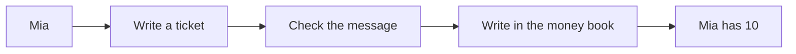

# Seev: A Story to Read Together

> [Documentation home](../README.md) · [Learn](README.md)

> **Status: Current concept story. Audience: a young child and a person reading
> with them.** This story teaches the main promise, not programming. The money
> and payment companies are pretend.

Open the [one-picture story](../seev-story.svg) so the child can follow the panels
while an adult reads.

## What is Seev?

Seev is like a recipe book for computers.

The recipes tell a pretend wallet team how to remember money carefully. Seev
is not a phone app, a bank, or real money.

## Mia's wallet team

Mia has an empty wallet. Her helpers have different jobs:

- one helper checks that Mia is Mia;
- one writes tickets for money coming in;
- one looks after money going out;
- one keeps the big money book; and
- one checks that the other helpers agree.

Different jobs make it easier to see who did what.

## Mia adds pretend coins

Mia asks to add ten pretend coins.

First, a helper writes a ticket. The ticket says what Mia wants, but it is not
money.

The payment company sends a message. Seev asks:

1. “Is this message really from the company?”
2. “Does it match Mia's ticket?”

Only after both checks does the big money book give Mia ten coins.

Why write the ticket first? A stranger must not be able to choose who gets the
coins.

## Mia shares and takes money out

In this small toy example, Mia sends three coins. Noah gets two, and one goes
to the fee box as a small charge for doing the job. All three changes happen
together.

Later, Mia asks to take out two coins. Seev puts them in a hold box so she
cannot spend them again while the payment helper is working.

- A clear “yes” finishes the job.
- A clear “no” gives the held coins back.
- No clear answer means Seev waits. It does not guess or try twice.

These toy numbers are only for this read-aloud story. They are not Seev's real
fee rules.

## Three promises

1. A ticket is a plan, not money.
2. The same request must not move money twice.
3. When Seev does not know, it waits for proof.

A messenger may tell Mia what happened. An inspector may find a disagreement.
Neither one may secretly change the big money book.

## One honest note for the grown-up

The learning code still has an old top-up shortcut that may continue without
finding the matching ticket. The safer planned design removes that shortcut.

## Ask the child

- Is a ticket already money? **No.**
- Should the same message add money twice? **No.**
- What should Seev do when it is not sure? **Wait and check.**

Continue with [Seev in five minutes](five-minute-tour.md) when the reader wants
the complete Mia and Noah example and the real names of the helpers.
