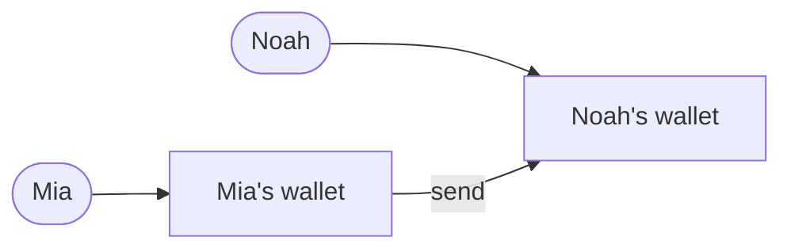
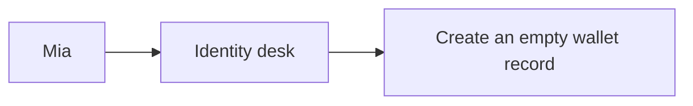
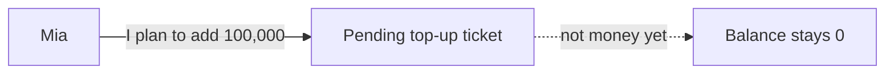
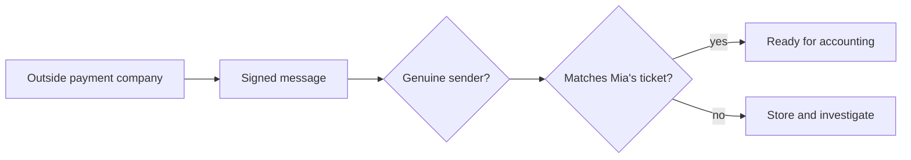
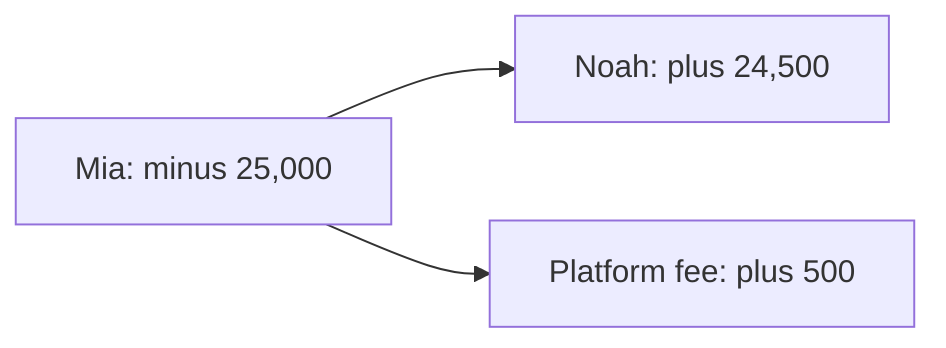
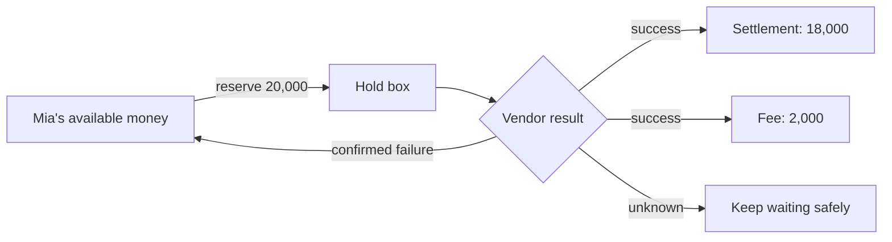
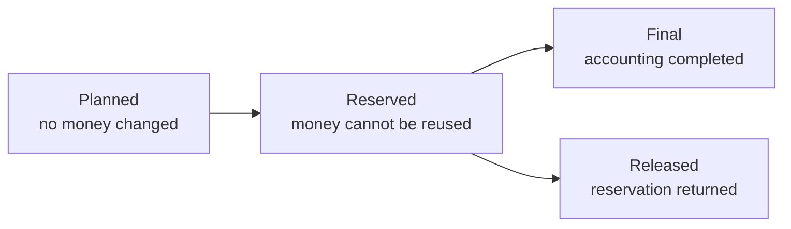
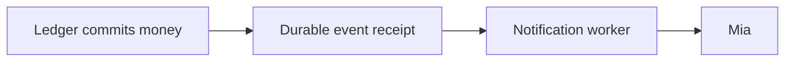
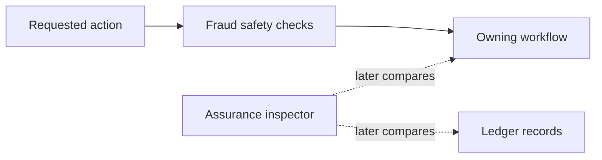
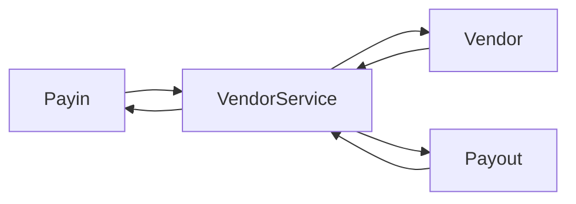

# Seev as a Visual Story

> [Documentation home](../README.md) · [Learn](README.md)

> **Status: Current concept guide. Audience: readers with no technology or
> finance background.** The pictures explain ideas, not every network detail.
> Current implementation gaps and future designs are labeled near the end.

For the shortest visual explanation, open
[Seev in one picture](../seev-story.svg). For a short text explanation, read
[Seev in five minutes](five-minute-tour.md).

## First: what is this repository?

This repository is a collection of instructions for computers. When those
instructions are started, they work together like the staff behind a practice
digital wallet.

It is not:

- money;
- a bank;
- a phone application;
- a real payment company; or
- permission to use the local setup for real customers.

It is a place to learn and test how wallet records can remain correct when
messages repeat, computers stop, or outside companies answer late.

## Meet Mia and Noah

Mia wants to add money, send some to Noah, and withdraw some to a bank. Noah
already has an empty wallet account.

The picture looks simple because it shows what people want. The system behind
it needs more steps to make that promise safe.

## Scene 1: Mia proves who she is

The identity desk remembers Mia's login and verification level. The accounting
book creates empty accounts for her. Creating an account does not create free
money.

**Why?** A person's identity document and their money history are different
kinds of sensitive information. One desk proves who Mia is; another records
money.

## Scene 2: Mia asks to add 100,000

The system gives Mia a ticket containing the expected amount, currency,
outside payment company, and tracking number. The technical names for the last
two are **vendor** and **reference**. The ticket is only a plan.

**Why?** The system needs its own expectation before an outside payment
company reports success. Without the ticket, the outside message could lack a
trustworthy connection to Mia.

The technical name for the ticket is a **top-up intent**.

## Scene 3: the payment company sends a message

Two checks answer different questions:

1. The signature helps prove who sent the exact message.
2. The ticket match checks whether Seev expected this vendor, reference,
   amount, currency, and workflow.

This is a digital signature, not handwriting. It is a proof calculated from
the exact message and a secret shared with the payment company. Changing the
message makes the proof invalid. It helps authenticate the message, but it
does not prove that the message matches Mia's ticket.

A genuine message can still be duplicated, old, malformed, or connected to
the wrong expectation. This is why a signature alone is not enough.

This diagram shows the intended safety rule. The current Payin implementation
still has a legacy unmatched-intent fallback; the exact gap and target fix are
stated in [Current behavior and the safer vendor target](#current-behavior-and-the-safer-vendor-target).

## Scene 4: the accounting book makes the money real

The accounting book writes both sides: where the value came from and where it
went. Both sides must equal 100,000.

**Why?** Changing only Mia's number would not explain the source. Equal sides
allow the system to prove it did not create or lose value internally.

The technical names are **Ledger** and **double-entry accounting**.

## Scene 5: Mia sends 25,000 to Noah

Suppose Seev first promises that the fee will be 500. That stored price promise
is called a **fee quote**. The fee is deducted from the requested amount.

After the transfer:

- Mia has 75,000;
- Noah has 24,500; and
- the fee account has 500.

The total leaving Mia equals the total entering Noah and the fee account.

**Why do all parts happen together?** Mia must not lose 25,000 if Noah and the
fee account fail to receive their matching parts. The filing cabinet—the
technical name is **database**—accepts all of the entries or none of them.

## Scene 6: Mia asks to withdraw 20,000

The payout fee is 2,000, so 18,000 will enter the outside path toward Mia's
bank if the withdrawal succeeds. The technical name for that path is the
**settlement rail**. The repository only records a mock version; it does not
contact a real bank.

While the 20,000 is in the hold box, Mia cannot spend it elsewhere.

- Success closes the hold and records settlement plus fee.
- Confirmed failure returns the full amount and charges no payout fee.
- No answer keeps the result unknown.

After success, Mia has 55,000 available. The settlement rail received 18,000,
and this withdrawal added 2,000 to the platform fee account. Together with the
earlier 500 transfer fee, the fee account now contains 2,500.

**Why wait after no answer?** The vendor may have accepted the payout before
the connection disappeared. Sending the same money through a second vendor
could pay twice.

## Three states that must not be confused

| State | Everyday meaning | Example |
|---|---|---|
| Planned | “We intend to try this” | Pending top-up intent |
| Reserved | “Keep this amount aside” | Withdrawal hold |
| Final | “The accounting book committed it” | Posted top-up, transfer, or settled payout |
| Released | “The unfinished attempt is cancelled” | Cancelled withdrawal returns the hold |

A screen saying “request received” must not be mistaken for final money.

## What Mia may safely be told

This repository does not contain Mia's mobile app. However, it defines the
facts that a future app would use. The app should never show a stronger claim
than the stored evidence supports. A stored fact remains available after a
computer or service restarts.

| What the app may say | Evidence behind the message | What Mia can safely believe |
|---|---|---|
| “Request received” | Payin or Payout stored the request | Seev plans to process it; money may not have changed |
| “Money reserved” | Ledger stored a withdrawal hold | Mia cannot reuse that amount; the bank may not have received it |
| “Transfer complete” | Ledger committed the sender, receiver, and fee entries together | The wallet transfer is final and a retry will not repeat it |
| “Top-up complete” | Safe target: Payin stored its final state after the matching Ledger post | The expected top-up workflow and wallet balance agree |
| “Withdrawal complete” | Safe target: Payout stored settlement after confirmed vendor success and Ledger closed the hold | The withdrawal workflow is final, not merely submitted |
| “Still checking” | The vendor outcome is uncertain or recovery work remains | Seev refuses to guess; Mia should not submit a second withdrawal |
| “Failed” | A final failure is known and any hold was released | The attempt will not later become successful without a new request |

Why does the wording matter? “Received,” “reserved,” and “complete” describe
different promises. If an app calls all three “success,” Mia cannot know
whether she can spend the money or safely try again.

The top-up and withdrawal rows describe the safer notification target in
[plan 54](../roadmap/active/54-vendor-service-boundary.md). Today, Ledger can announce its
completed money record before the workflow owner has saved its own final
state. Current code must therefore not be presented as already meeting that
target.

## Scene 7: the messenger works after the accountant

The accountant records money first. The messenger may deliver later.

**Why?** A broken messenger must not erase a valid accounting entry. The
receipt remains stored and delivery retries.

A notification is useful information, but it is not the source of truth for a
balance.

## Scene 8: the safety officer and inspector

The safety officer checks risk before selected actions and watches patterns
after events. The inspector later compares what the money-in, money-out, and
accounting records say.

Neither role can edit a balance.

**Why separate them?** A checker should not quietly repair the thing it is
checking. Disagreement remains visible for investigation.

## Four failure stories

### The same letter arrives twice

The system recognizes the operation's stable identity and returns or continues
the first result. It does not repeat the money movement.

Technical name: **idempotency**.

### A worker stops halfway

For payout dispatch, important unfinished work was stored before the worker
called the vendor. Another worker or the restarted process can continue from
that record.

Technical names: **durable command** and **recovery worker**.

### The mailroom is temporarily closed

The accounting result and event receipt remain stored. Delivery resumes when
the message system returns.

Technical names: **transactional outbox** and **retry**.

### Two record books disagree

Assurance creates a finding. An operator checks evidence instead of allowing
the inspector to invent a correction.

Technical names: **assurance finding** and **reconciliation**.

## Translate the story into Seev names

| Story role | Seev name |
|---|---|
| Customer-facing front desk | Gateway |
| Identity desk | Auth |
| Top-up ticket owner | Payin |
| Withdrawal and hold coordinator | Payout |
| Permanent accounting book | Ledger |
| Safety officer | Fraud |
| Operator workspace | Admin BFF |
| Independent inspector | Assurance |
| Filing cabinets | Separate PostgreSQL databases |
| Short-lived shared notes | Redis |
| Mailroom | RabbitMQ |

## Current behavior and the safer vendor target

Today, Payin vendor callbacks first enter Gateway and then reach Payin. Payout
contains its vendor adapter and calls the payout vendor directly.

The target in [plan 54](../roadmap/active/54-vendor-service-boundary.md) changes this to:

VendorService would authenticate and translate vendor communication. Payin
and Payout would still check their own intent or request before changing
business state. VendorService would not choose a user or move Ledger money.

This is labeled **target** because that service is not implemented yet. The
current Payin code also retains a legacy fallback that can use a vendor
payload's user id when no intent matches. The target removes that unsafe
compatibility behavior.

## Tell the story back in five answers

You have the core picture if you can answer:

1. Why does a top-up ticket not change Mia's balance?
2. Why must an outside message be both genuine and matched to an internal
   expectation?
3. Why does a withdrawal use a hold box?
4. Why may a notification arrive after the accounting result?
5. Why can the inspector report a disagreement but not repair money?

For more detail, continue to the [beginner guide](beginner-guide.md), then the
[product tour](product-tour.md). Use the [glossary](../reference/glossary.md) for any
unfamiliar technical name and the [why guide](../reference/rationale.md) for tradeoffs.
