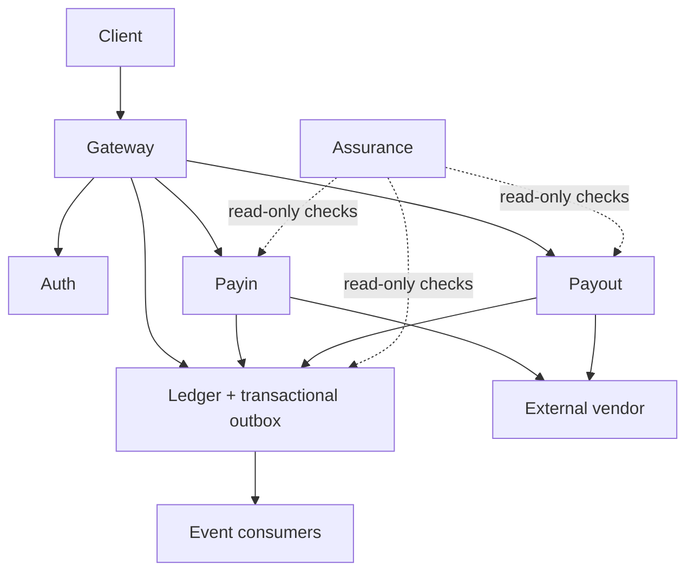

# Evaluate Seev in Five Minutes

> A five-minute evidence route for engineering reviewers and hiring
> decision-makers.
>
> Status: Current implementation and executable evidence.

## Minute 1 — Problem

How can a wallet move money exactly once across retries, crashes, delayed
callbacks, and unreliable external vendors?

Seev treats this as a financial-correctness problem, not only an API-design
problem. A successful response is insufficient unless the resulting money
movement remains balanced, idempotent, recoverable, and auditable.

## Minute 2 — Architecture

Solid arrows change or deliver state; dotted arrows independently verify it.
Ledger is the permanent record of money movement, while its transactional
outbox preserves an event for later delivery.

## Minute 3 — Three invariants

1. **Every posting balances.** For every committed transaction, total debits
   equal total credits.
2. **One business operation changes money once.** Retries, duplicate
   callbacks, and concurrent requests can repeat delivery but not the monetary
   effect.
3. **Corrections append compensating history.** Posted financial history is
   not rewritten; a correction is a new, attributable entry.

## Minute 4 — Three proofs

### 1. Concurrent duplicate request

[Twenty concurrent retries produce one monetary effect](https://github.com/herdifirdausss/seev/blob/main/services/ledger/internal/ledger/idempotency_digest_integration_test.go#L120-L154)

`TestIdempotency_ConcurrentRetries_ExactlyOneMonetaryEffect` sends twenty
identical requests concurrently. The final balance changes once and exactly
one ledger transaction is stored.

### 2. Broker outage recovery

[Transactions survive a broker outage and publish after recovery](https://github.com/herdifirdausss/seev/blob/main/scripts/chaos-test.sh#L132-L210)

`scenario_2` posts money while RabbitMQ is down. After recovery, the durable
outbox drains without dead events; the harness then probes downstream
notification after the relay has caught up.

### 3. Payout unknown-state recovery

[An uncertain payout remains pinned and settles at most once](https://github.com/herdifirdausss/seev/blob/main/scripts/chaos-test.sh#L851-L984)

`scenario_8` treats a timeout as uncertainty, not rejection. It keeps the
in-flight payout with its original vendor, asserts one settlement only, and
verifies that the ledger remains balanced.

## Minute 5 — Measured evidence

- [Historical local benchmark — bounded evidence, not a production-capacity claim](../performance/reports/2026-07-baseline.md)
- [Broker-outage metric snapshot from a retained local run](assets/money-flow-recovery.svg)
- [Payout unknown-state recovery timeline](assets/payout-unknown-state-timeline.svg)
- [Known limitations and claims Seev deliberately does not make](../learn/product-tour.md#what-seev-deliberately-does-not-claim)

The benchmark predates the current self-seeding load harness and is retained
as historical local evidence, not a production-capacity or readiness claim.
The recovery snapshot and timeline report retained local run data and database
assertions; they are reproducible evidence, not a production-readiness claim.
