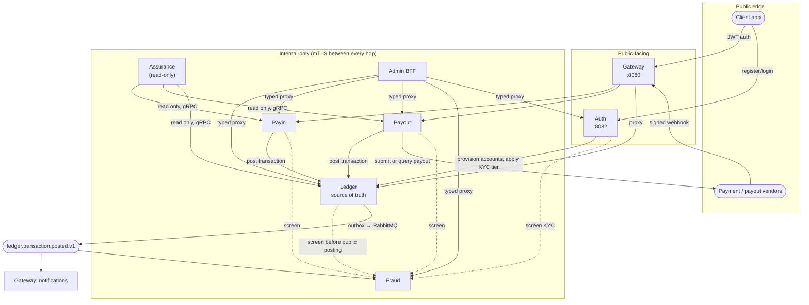
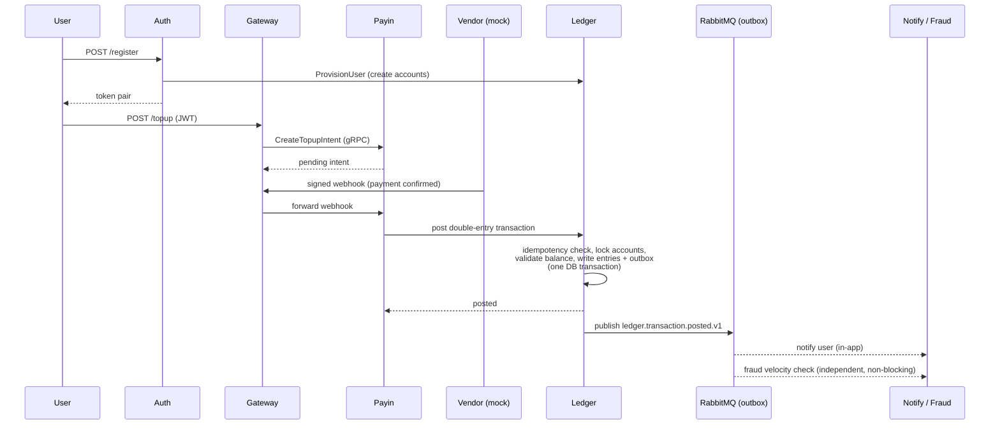

# Architecture

> [Documentation home](../README.md) · [Reference](README.md)

> **Status: Current.** This document describes the runtime implemented in the
> repository. Proposed changes, including the dedicated VendorService
> boundary, remain in the [plan archive](../roadmap/README.md) until their code
> and acceptance tests are complete.

This document explains **why Seev exists, what problem it solves, and how
it's built to solve it** — for both a business reader and a technical
reader. [README.md](../../README.md) is the quick-start; [Onboarding](../development/onboarding.md)
is the guided code tour; this document is the "why does it look like this"
layer that sits above both.

If terms such as ledger, idempotency, or payout are unfamiliar, start with
[Seev, explained from start to finish](../learn/beginner-guide.md) or keep the
[glossary](glossary.md) open while reading. The
[product tour](../learn/product-tour.md) is the intermediate layer that connects
every user and operator journey before this document introduces architecture
tradeoffs. [Why Seev works this way](rationale.md) provides a plain-English
rationale catalog when you need one decision rather than the complete design.
[Concept-to-code traceability](traceability.md) points from these claims
to their implementation and proof.

## 1. The general problem

Any product that lets people hold and move money — a digital wallet, a
payments platform, a neobank — has to solve the same hard problems
underneath, regardless of what the app looks like on the surface:

- **Money must never be created, destroyed, or duplicated by accident.**
  A network retry, a crashed process, or a concurrent request must never
  turn one transfer into two, or one top-up into zero.
- **Every balance must be provably correct**, not just "probably correct"
  — an auditor, a regulator, or an incident responder must be able to
  reconstruct exactly how a balance got to its current value.
- **The system must talk to unreliable outside parties** — payment
  gateways, banks — whose webhooks arrive late, out of order, or twice,
  and whose settlement reports need to be reconciled against what the
  system believes happened.
- **Money movement must be gated by compliance, not just by code working
  correctly** — identity verification (KYC), limits by verification tier,
  fraud/sanctions screening, and an audit trail for every operator action.
- **The system has to stay correct as it grows** — from a single team
  shipping a fast MVP, to multiple teams that need independent deploys,
  independent scaling, and isolated blast radius when something breaks.

Most of the real-world engineering difficulty in fintech is in these
problems, not in the UI. Seev is a reference implementation of solving all
of them together, honestly — including the parts that are usually skipped
in tutorials (idempotency under concurrent retries, fail-open vs
fail-closed decisions, reconciliation against a source of truth that can
itself disagree with reality, and the operational discipline of proving a
security fix actually works instead of just merging it).

## 2. What Seev is

Seev is a service-oriented fintech backend: a ledger-first digital-wallet
platform covering identity/KYC, top-up (pay-in), withdrawal (payout),
fraud/AML screening, an operator console, and continuous cross-service
assurance — all built around one non-negotiable rule: **every
balance-affecting action becomes a balanced, append-only, double-entry
posting in one ledger.** Nothing moves money any other way, no matter how
many services sit around that ledger.

It's designed to be *learned from and validated against*, not just run —
the default credentials and vendor integrations are for local development
only.

## 3. How it was built: monolith first, services only with evidence

Seev didn't start as eight services. It started as **one binary, one
database, with module boundaries enforced by code** (`boundary_test.go`,
still running today) — the ledger posting engine was built and hardened
first, since it's the hardest part to get right and everything else
depends on it being correct.

Services were only carved out once specific, evidence-based **extraction
triggers** were actually met — not because "microservices are the
architecture":

> Extract a module only when at least one of these is supported by
> evidence: it needs a materially different deployment cadence; its
> incidents have a demonstrated blast radius against ledger posting; its
> load scales independently; multiple teams need independent ownership;
> or compliance requires organizational/data isolation. Until then, a
> split adds network hops, deployment surfaces, and distributed tracing
> requirements without a demonstrated benefit.
> — [docs/roadmap/archive/21](../roadmap/archive/21-service-topology-review.md)

The guiding principle stated in that same document is the whole
philosophy in one line:

> "Service or module" is a deployment decision, not a code decision. A
> cleanly bounded module can run in one binary today and in an
> independent service later without rewriting its business logic.

Concretely, the build order was: ledger core → policy/limits → auth →
pay-in/vendor gateway → payout orchestration → fraud → the service
extraction itself (ledger, auth, payin, payout, fraud, gateway, admin-BFF)
→ product assurance as an independent read-only verifier → internal
security hardening (mTLS everywhere). Each phase is a self-contained,
numbered document under [docs/roadmap/](../roadmap/README.md) — an archive of
*why* each decision was made, not just what changed.

## 4. Business architecture: what the system actually does

Mapping services to business capabilities, not technical layers:

| Business capability | Owning service | What it means in practice |
|---|---|---|
| **Identity & KYC** | Auth | Registration, login, session/token lifecycle, tiered identity verification (KYC level 0/1/2) that gates how much money a user is allowed to move |
| **Top-up (pay-in)** | Payin | A user adds money via a payment gateway vendor; intent → vendor webhook confirms → ledger posting |
| **Withdrawal (payout)** | Payout | A user (or the platform) sends money out via a payout vendor; hold → settle/cancel lifecycle, with crash-safe recovery |
| **Money movement & source of truth** | Ledger | Every balance, every posting, every fee, every reversal — the one place money is "real" |
| **Risk & compliance** | Fraud | Synchronous screening before a transaction posts, asynchronous velocity/pattern checks after, sanctions screening on KYC submissions |
| **Continuous assurance** | Assurance | An independent, read-only watchdog that cross-checks payin/payout against the ledger and raises findings — it can *pause new intake* in an emergency, but it can never move money itself |
| **Operations** | Admin BFF | The console operators use: maker-checker approval for sensitive actions (e.g. ledger adjustments), a full audit log, and typed proxying to the six operational admin APIs; Assurance also has a dedicated operator CLI and admin API |
| **Public composition** | Gateway | The single public surface end-user clients talk to (alongside Auth's own public edge) — composes calls to the internal services, fans out ledger events to user notifications |

This maps closely to how a real digital-wallet or PSP-adjacent product is
organized: a **product/onboarding layer** (Auth), a **money-in and
money-out layer** (Payin/Payout) sitting on top of a **ledger of record**,
a **risk layer** (Fraud) that can veto but never itself moves money, an
**assurance/audit layer** (Assurance) that trusts nothing and verifies
everything after the fact, and an **operations layer** (Admin BFF) with
segregation-of-duties controls built in rather than bolted on.

### Financial invariants (non-negotiable, enforced in code and tests)

- `ledger_entries` is append-only — corrections are new compensating
  transactions, never an update or delete.
- Every transaction balances: total debit equals total credit.
- Every posting command requires an idempotency key — a retried request
  returns the original result, never a duplicate.
- Monetary values are `decimal.Decimal` or integer minor units in Go, and
  `BIGINT` minor units in Postgres — never a binary float.
- A service never writes another service's tables — money-relevant state
  changes only through the ledger's own API/events.

## 5. Technical architecture

### 5.1 Service topology

**In plain English:** users enter through Gateway or Auth. Internal services
perform focused jobs, but only Ledger can make a balance change real. In the
current implementation, Payin vendor callbacks enter through Gateway before
Payin verifies and processes them.

Each box owns exactly one PostgreSQL database; nothing queries across that
line — every cross-service interaction is an explicit HTTP, gRPC, or event
contract. See [README.md](../../README.md#runtime-architecture) for the full
port/database table and [Onboarding](../development/onboarding.md#service-map-name--code--data)
for how each service name maps to its actual code location (they don't
always match — that's flagged there for a reason).

### 5.2 One transaction, start to finish

**In plain English:** creating a top-up only records an expectation. The
balance changes later, after a signed vendor message reaches Payin and Ledger
records the accounting transaction. A notification is a consequence of that
record; it is not proof by itself that money moved.

The diagram below is current behavior, including Gateway as the callback edge.
It should not be mistaken for the stricter target: the current Payin code also
retains a legacy unmatched-intent `user_id` fallback. The dedicated
VendorService and strict owner-domain correlation are explicitly future work
in [plan 54](../roadmap/active/54-vendor-service-boundary.md).

A user topping up their wallet touches almost every architectural idea in
the system:

The posting step is deliberately the most rigorous part of the entire
codebase — it's the one function in the repo that the
[project guide](../development/project-guide.md) calls out by name as
requiring a full understanding of the idempotency gate,
lock order, validation order, balance projection, posting, and outbox
guarantees before anyone touches it
(`internal/ledger/service/handle/service.go`'s `execTransfer`).

### 5.3 Technology choices and why

| Concern | Choice | Why |
|---|---|---|
| Language | Go | Strong typing for money-handling code, fast compilation for a multi-service repo, first-class concurrency for the posting engine's locking/retry logic |
| Money representation | `decimal.Decimal` (Go) / `BIGINT` minor units (Postgres) | Binary floats cannot represent currency exactly; this is a correctness requirement, not a style choice |
| Ledger database | PostgreSQL, one schema per service | Strong transactional guarantees (`FOR UPDATE`, `SERIALIZABLE`-adjacent locking) for the posting engine; per-service ownership prevents silent cross-service coupling |
| Cross-service events | RabbitMQ via a transactional outbox | The outbox row is written in the *same* DB transaction as the posting — "posted" and "the event will eventually publish" can never diverge, even across a crash |
| Service calls | gRPC (internal) + HTTP (public/admin) | Typed contracts internally where performance/latency matter; plain HTTP where a browser or curl needs to reach it |
| Internal transport security | Mutual TLS with SPIFFE-style URI SAN identities (`pkg/tlsx`) | Every internal hop authenticates *which service* is calling, not just *that a token was presented* — see [docs/security/threat-model.md](../security/threat-model.md) for exactly what this replaced |
| Caching / coordination | Redis (optional) | Rate limiting, velocity checks, distributed locks for scheduled jobs — the system degrades explicitly (fail-open or fail-closed, by documented contract) rather than silently when Redis is unavailable |
| Observability | Prometheus, Grafana, Loki, Tempo (via Alloy) | Metrics, dashboards, logs, and traces as an opt-in profile — not required to run the system, required to operate it with confidence |
| CI | GitHub Actions, SHA-pinned actions, a docs-only fast path | A single required `ci-gate` check that's fast for docs, thorough for code: lint, unit tests, integration tests (testcontainers), and a full 8-image container smoke test |

### 5.4 Security model, in one paragraph

Public clients authenticate with JWT (users) or HMAC-signed webhooks
(vendors). Every hop *between* services — gRPC or internal HTTP, all
eight services — is mutually authenticated by mTLS, where identity is the
certificate's URI SAN, never a Common Name or "signed by our CA" alone; a
new caller has to be added to its callee's allowlist explicitly, it's
never inferred. Certificates are short-lived and rotate without a
restart. The full asset inventory, trust boundaries, and a findings
register with severity and resolution evidence for each one lives in
[docs/security/threat-model.md](../security/threat-model.md) — it's a
living document, not a one-time audit.

## 6. How business rules and technical design reinforce each other

A few examples of where the "business" answer and the "technical" answer
are the same decision, because in a ledger system they have to be:

- **"Can we trust this balance?"** is answered technically by
  append-only entries + a daily trial-balance verification job, and that
  technical answer *is* the business answer — there's no separate
  "business logic" for balance trust sitting on top of it.
- **"What happens if fraud-service is down?"** is a business risk
  decision (block transactions vs. let them through) that's implemented
  as an explicit, tested fail-open/fail-closed contract per code path —
  documented, not assumed, and specifically NOT the same answer
  everywhere (KYC screening and velocity checks have different failure
  postures, on purpose).
- **"Who can approve a manual ledger adjustment?"** is a business
  segregation-of-duties requirement (maker-checker: the proposer can't
  also be the approver) enforced as a technical constraint where the
  adjustment actually lives — Ledger's own adjustments logic rejects a
  same-person approval outright — with Admin BFF layering session
  identity, role-gated UI, and an audit log on top, not a policy anyone
  has to remember to follow.
- **"Assurance found a mismatch — can it stop the bleeding?"** Assurance
  can pause new intake (a business circuit breaker) but has zero write
  access to any domain table (a technical guarantee) — it can slow the
  business down but can never itself become a way to move money
  incorrectly.

## 7. Where to go deeper

| You want... | Read |
|---|---|
| Every service's problem statement, full endpoint/job surface, and dependencies | [Services](services.md) |
| What Compose, the Makefile, scripts, CI, and observability each solve and how | [Operations](../operations/README.md) |
| What each `pkg/` package does and who uses it | [Shared packages](shared-packages.md) |
| To run it locally | [README.md](../../README.md) |
| To navigate the code, folder-by-folder | [Onboarding](../development/onboarding.md) |
| The contributor rulebook (what you must never do) | [Project guide](../development/project-guide.md) |
| The full evolution history, phase by phase | [docs/roadmap/](../roadmap/README.md) |
| The security posture and its evidence | [docs/security/threat-model.md](../security/threat-model.md) |
| The wire contract for ledger events | [docs/reference/events.md](events.md) |
| What to do when something breaks | [docs/operations/runbooks/](../operations/runbooks/) |
| How to contribute | [CONTRIBUTING.md](../../CONTRIBUTING.md) |
