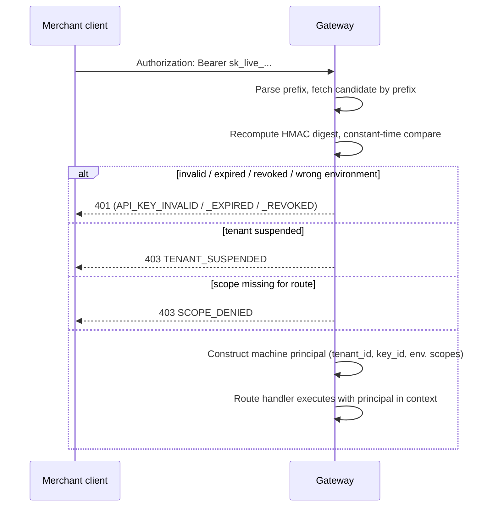
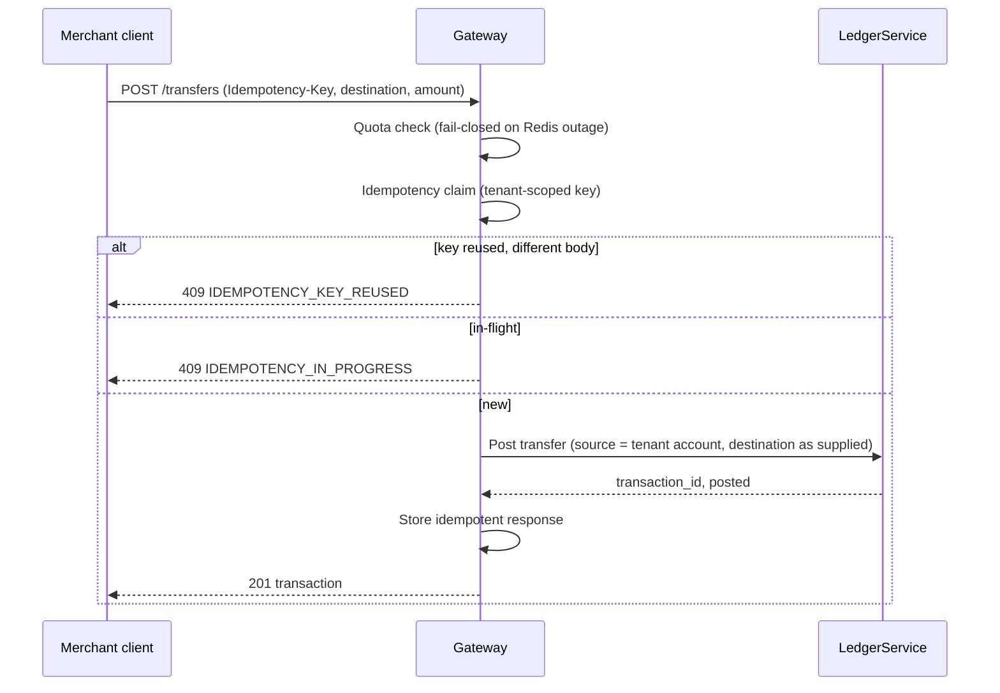
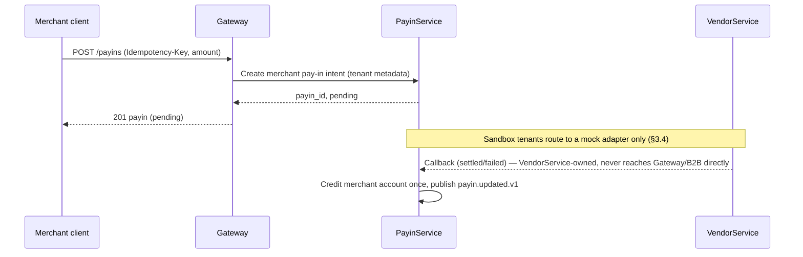
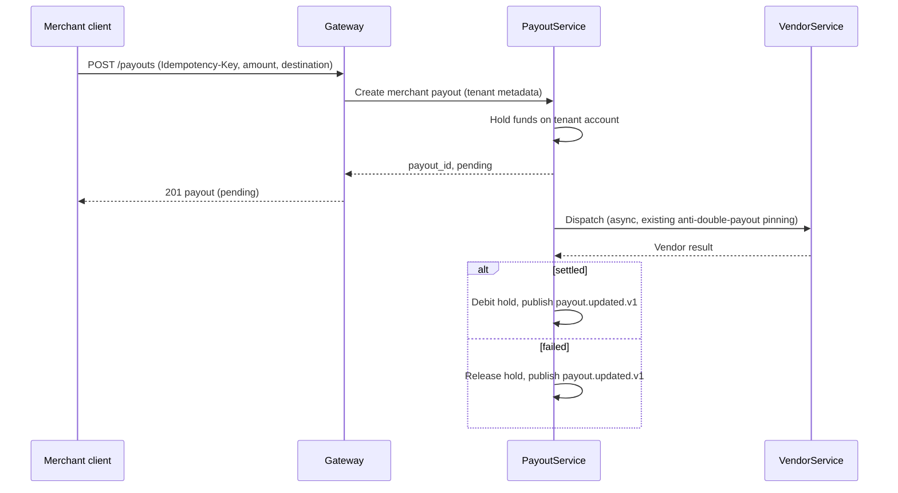
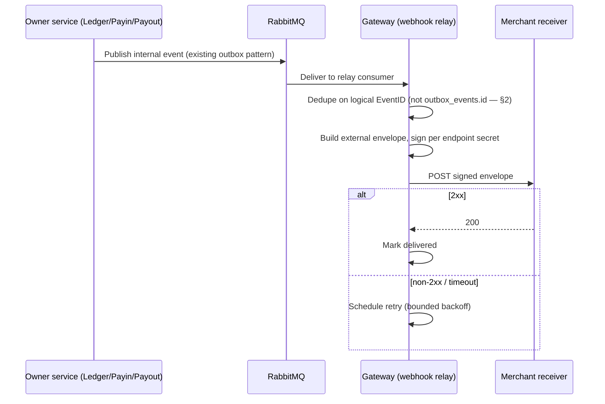
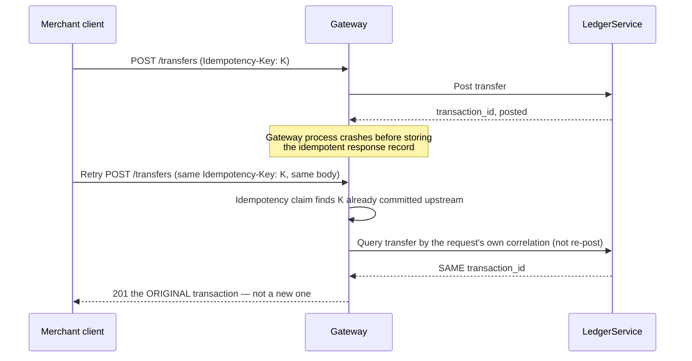

# C1 Merchant/B2B API — Locked Design (Plan 57 T1)

> [Documentation home](../README.md) · [Reference](README.md) ·
> [Plan 57](../roadmap/active/57-c1-merchant-b2b-api.md)

This is the T1 deliverable required by
[Plan 57 §20 T1](../roadmap/active/57-c1-merchant-b2b-api.md#t1--lock-contracts-states-and-trust-boundaries):
public state mappings, the webhook envelope/signature scheme, every required
sequence diagram, and the failure matrix. The OpenAPI contract itself is
[api/openapi/b2b-v1.yaml](../../api/openapi/b2b-v1.yaml), registered in
[api/contracts/surfaces.yaml](../../api/contracts/surfaces.yaml).

## 1. Public state mappings

The B2B surface never exposes an owner service's internal status enum
directly — each is mapped to a small, stable public set so a future internal
state addition is never a breaking B2B change.

### 1.1 Transfer (Ledger transaction)

| Public status | Meaning |
|---|---|
| `posted` | Balanced entries exist; money has moved. |
| `reversed` | A reversal transaction exists and is posted. |
| `failed` | Rejected before posting; no money moved. |

### 1.2 Pay-in

| Public status | Meaning |
|---|---|
| `pending` | Intent created; awaiting settlement signal. |
| `settled` | Confirmed by the owner service; account credited. |
| `failed` | Rejected or expired without settling. |

### 1.3 Payout

| Public status | Meaning |
|---|---|
| `pending` | Created; hold placed, not yet dispatched. |
| `processing` | Dispatched to a vendor adapter; outcome uncertain. |
| `settled` | Vendor confirmed; hold released as a debit. |
| `failed` | Vendor rejected or was cancelled; hold released, no debit. |

### 1.4 Webhook delivery

| Public status | Meaning |
|---|---|
| `pending` | Queued or leased for an attempt. |
| `delivered` | Receiver returned a 2xx. |
| `failed` | Attempt returned non-2xx or timed out; retry scheduled. |
| `dead` | Retry schedule exhausted; no further automatic attempt. |

## 2. Webhook envelope and signature (locked)

Every outbound delivery body is:

```json
{
  "id": "evt_7a1d9c3e5f0b2846",
  "type": "transaction.posted.v1",
  "livemode": true,
  "created_at": "2026-01-02T03:04:05Z",
  "data": {}
}
```

- `id` is the external event ID — derived from (and stable across redelivery
  with) the same internal logical `EventID` convention already used by
  `internal/ledger/events` (`uuid.NewSHA1(eventType+identity)`), NOT
  `outbox_events.id` (§3.5 of the entry-gate inventory explains why this
  distinction matters).
- `livemode` reflects the tenant/key environment (§3.4).
- Signature header:

  ```http
  Seev-Signature: t=1735808645,v1=<hex hmac-sha256>
  ```

  `v1` is `HMAC-SHA256(endpoint_secret, "{t}.{raw_body}")` — timestamp bound
  into the signed material (unlike the pre-existing mock-vendor inbound
  webhook signature, which the threat model already accepts as a residual
  risk for TM-08; C1's *outbound* signature does not repeat that gap since
  it is a new design, not an existing accepted risk being carried forward).
- Retries resend the exact same bytes and `id`; the timestamp is NOT
  refreshed on retry, so `v1` stays reproducible for a given attempt log.

## 3. Sequence diagrams

### 3.1 Merchant tenant + key provisioning

```mermaid
sequenceDiagram
    participant Op as Operator
    participant BFF as Admin BFF
    participant GW as Gateway (internal/merchant)
    participant L as LedgerService
    Op->>BFF: Create tenant (sandbox or live)
    BFF->>GW: POST tenant (session+CSRF, maker/checker for live)
    GW->>GW: Insert tenant row (Gateway DB)
    GW->>L: Provision merchant ledger account (idempotent)
    L-->>GW: account_id
    Op->>BFF: Create API key for tenant
    BFF->>GW: POST key (scopes, environment)
    GW->>GW: Generate secret, store HMAC digest + prefix only
    GW-->>BFF: Plaintext key (ONE TIME)
    BFF-->>Op: Display once; never re-rendered
```

### 3.2 B2B request authentication



### 3.3 Merchant transfer



### 3.4 Merchant pay-in



### 3.5 Merchant payout



### 3.6 Owner event to external webhook



### 3.7 Webhook retry and replay

```mermaid
sequenceDiagram
    participant GW as Gateway (relay worker)
    participant R as Merchant receiver
    participant M as Merchant client
    loop bounded retry schedule
        GW->>R: Redeliver exact same bytes + event id
        alt 2xx
            R-->>GW: 200
            GW->>GW: Mark delivered, stop
        else 410 Gone
            GW->>GW: Auto-disable endpoint, publish webhook.endpoint.disabled.v1
        else exhausted
            GW->>GW: Mark dead
        end
    end
    M->>GW: POST /webhook-deliveries/{id}/replay
    alt delivery not eligible (already delivered / not dead-or-failed)
        GW-->>M: 409 WEBHOOK_REPLAY_NOT_ALLOWED
    else eligible
        GW->>GW: New delivery ID, SAME event ID, re-attempt
        GW-->>M: 201 new delivery
    end
```



### 3.8 Gateway crash after owner success



## 4. Failure matrix

| Failure | Detected by | Effect | Recovery |
|---|---|---|---|
| Invalid/expired/revoked API key | Prefix lookup + digest compare | 401, no side effect | Client re-issues with a valid key |
| Wrong-environment key (sandbox key on live route or vice versa) | Prefix parse | 401 API_KEY_INVALID | Client uses correct key |
| Tenant suspended | Tenant status check (after key validation) | 403 TENANT_SUSPENDED | Operator reactivates tenant |
| Scope missing | Central route scope registry | 403 SCOPE_DENIED | Operator adds scope to key/template |
| Cross-tenant resource access | Tenant-ID-scoped repository query (§7.3) | 404 RESOURCE_NOT_FOUND (identical to a genuinely missing resource — no existence leak) | N/A — by design, not an incident |
| Redis quota backend unavailable | Health-checked limiter call | Financial writes fail-closed 503 QUOTA_UNAVAILABLE; reads degrade to bounded fallback | Redis recovers; no write was silently allowed |
| Idempotency key reused, different body | Canonical request hash mismatch | 409 IDEMPOTENCY_KEY_REUSED | Client uses a new key for a genuinely new request |
| Idempotency key in flight (concurrent retry) | Claim/lease row exists, not yet complete | 409 IDEMPOTENCY_IN_PROGRESS | Client retries after a short backoff |
| Gateway crash after owner-service success, before response persisted | Idempotency recovery query against the owner service (§3.8) | Client retry returns the ORIGINAL resource, not a duplicate | Automatic on next client retry — no operator action |
| Owner service (Ledger/Payin/Payout) unavailable | Typed client error | 503 OWNER_SERVICE_UNAVAILABLE; no partial write | Client retries after backoff |
| Duplicate internal event (outbox at-least-once) | Logical `EventID` dedup at the relay | No duplicate external event/webhook | N/A — by design |
| Webhook endpoint URL targets private/link-local/metadata IP | SSRF validation before dispatch (live mode only) | 400/422 WEBHOOK_ENDPOINT_INVALID at creation; dispatch-time re-check rejects silently changed DNS | Merchant configures a public, non-internal endpoint |
| Webhook endpoint returns 410 | Relay worker | Endpoint auto-disabled; `webhook.endpoint.disabled.v1` fires | Merchant re-creates/re-enables the endpoint |
| Webhook endpoint down/slow | Bounded timeout + response-size limit per attempt | Attempt marked failed; retried on schedule; eventually dead | Merchant fixes endpoint, replays dead/failed deliveries |
| Webhook relay worker crash mid-lease | Lease expiry | Another worker instance reclaims the expired lease | Automatic on next worker tick |
| Sandbox tenant attempts a live vendor route | Routing enforcement at Payin/Payout | Request rejected before reaching any real vendor adapter | N/A — sandbox tenants cannot reach this state by design |
| Currency mismatch (transfer/payin/payout) | Owner service validation before posting | 422 CURRENCY_MISMATCH; no posting | Client corrects currency |
| Insufficient funds | Ledger balance check (existing `FOR UPDATE`/atomic delta path) | 422 INSUFFICIENT_FUNDS; no posting | N/A — client must fund the account first |

## 5. Threat model and architecture updates

New trust boundary and findings recorded in
[docs/security/threat-model.md](../security/threat-model.md) (TM-15 through
TM-19). Service ownership recorded in
[docs/reference/services.md](services.md)'s Gateway entry (`internal/merchant`
sub-module, Gateway-owned persistence only, no cross-service DB access —
Plan 57 §3.1/§3.3).
