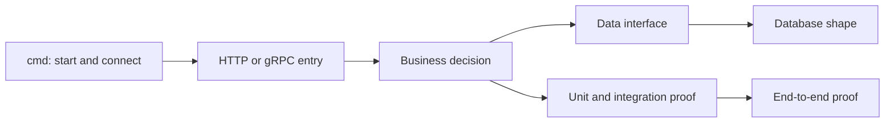

# Concept-to-Code Traceability

> [Documentation home](../README.md) · [Reference](README.md)

> **Status: Current. Audience: readers who understand the story and now want to
> verify it.** This page does not teach each feature again. It points from the
> plain-language claim to its owner, implementation, durable data, and proof.

## Why this map exists

A public repository should make important claims inspectable. “Top-up is
idempotent” is more trustworthy when a reader can find:

1. the document explaining what that means;
2. the service that owns the decision;
3. the code implementing it;
4. the schema preserving it; and
5. the test or journey proving it.

Use the [visual story](../learn/visual-story.md), [beginner guide](../learn/beginner-guide.md),
[product tour](../learn/product-tour.md), or [why guide](rationale.md) for explanation. Use
this page only when you want to inspect evidence.

## How code is normally followed

```mermaid
flowchart LR
    Start[cmd: start and connect] --> Transport[HTTP or gRPC entry]
    Transport --> Domain[Business decision]
    Domain --> Repository[Data interface]
    Repository --> Migration[Database shape]
    Domain --> Test[Unit and integration proof]
    Test --> Journey[End-to-end proof]
```

- `services/*/cmd/` creates dependencies and starts a service process;
  `tools/` and `operations/` contain non-service entrypoints.
- A transport handler translates an HTTP or gRPC request.
- Domain code decides what is allowed.
- A repository stores or reads owned data.
- Migrations define the durable database structure.
- Tests prove small rules; scripts prove complete journeys and recovery.

## System startup and boundaries

| Question | Source |
|---|---|
| Which programs can be started? | Service entrypoints under [`services/*/cmd/`](../../services/), with developer tools under [`tools/`](../../tools/) and operator workflows under [`operations/`](../../operations/) |
| How are local services and dependencies connected? | [`docker-compose.yml`](../../docker-compose.yml) |
| Which service imports are forbidden? | [`boundary_test.go`](../../boundary_test.go) |
| Where is configuration loaded? | [`internal/platform/config/config.go`](../../internal/platform/config/config.go) |
| What proves fresh containers can start together? | [`scripts/smoke-container.sh`](../../scripts/smoke-container.sh) |

The executable system currently has nine core business services. The optional
`tools/mock-push-provider` is a local notification sink, while utilities under
`tools/` such as the certificate generator and documentation checker are not
services because they do not keep listening for business requests.

## Identity and KYC

| Layer | Source |
|---|---|
| Plain explanation | [Product tour: identity, login, and KYC](../learn/product-tour.md#journey-1-identity-login-and-kyc) |
| Owner and interfaces | [Services: Auth](services.md#auth) |
| HTTP entry and authentication | [`services/auth/internal/transport/http/http.go`](../../services/auth/internal/transport/http/http.go), [`services/auth/internal/auth/auth.go`](../../services/auth/internal/auth/auth.go) |
| KYC decision and recovery | [`services/auth/internal/auth/kyc.go`](../../services/auth/internal/auth/kyc.go), [`services/auth/internal/worker/retry.go`](../../services/auth/internal/worker/retry.go) |
| Owned data | [`services/auth/migrations/`](../../services/auth/migrations/) |
| Focused proof | [`services/auth/internal/auth/kyc_integration_test.go`](../../services/auth/internal/auth/kyc_integration_test.go), [`services/ledger/internal/transport/grpc/kyc_tier_integration_test.go`](../../services/ledger/internal/transport/grpc/kyc_tier_integration_test.go) |
| Complete proof | KYC section in [`scripts/business-e2e.sh`](../../scripts/business-e2e.sh) |

The key cross-service rule is “limits first, claim second”: Ledger receives the
new policy tier before Auth exposes the upgraded KYC claim in refreshed tokens.

## Top-up and vendor callback

| Layer | Source |
|---|---|
| Plain explanation | [Visual story: top-up ticket](../learn/visual-story.md#scene-2-mia-asks-to-add-100000), [Product tour: adding money](../learn/product-tour.md#journey-3-adding-money) |
| Public entry | [`services/gateway/internal/transport/http/topup.go`](../../services/gateway/internal/transport/http/topup.go) |
| Internal contract | [`contracts/proto/seev/payin/v1/payin.proto`](../../contracts/proto/seev/payin/v1/payin.proto) |
| Intent and callback decisions | [`services/payin/internal/payin/topup.go`](../../services/payin/internal/payin/topup.go), [`services/payin/internal/payin/payin.go`](../../services/payin/internal/payin/payin.go) |
| Vendor boundary and callback ingress | [`services/vendor-service/internal/`](../../services/vendor-service/internal/), [`services/vendor-service/cmd/vendor/main.go`](../../services/vendor-service/cmd/vendor/main.go) |
| Owned data | [`services/payin/migrations/`](../../services/payin/migrations/) |
| Focused proof | [`services/payin/internal/payin/topup_test.go`](../../services/payin/internal/payin/topup_test.go), [`services/payin/internal/payin/payin_integration_test.go`](../../services/payin/internal/payin/payin_integration_test.go) |
| Complete proof | Top-up section in [`scripts/business-e2e.sh`](../../scripts/business-e2e.sh) |

The active callback path uses owner-domain correlation without an authoritative
vendor-supplied user identifier. Payin and Payout use only normalized
VendorService callbacks; the deprecated Payin v1 raw method is unimplemented.
Host, container, and business journeys exercise this path. Manual crash
recovery remains a separate operational gate; its current result is recorded in
the [operations status](../operations/README.md#standalone-drills-and-operator-tools--not-part-of-verify-full).
The historical boundary decisions are preserved in [archived Plan 54](../roadmap/archive/54-vendor-service-boundary.md).

## Fee quote and user-to-user transfer

| Layer | Source |
|---|---|
| Plain explanation | [Worked balance example](../learn/product-tour.md#a-worked-example-with-visible-balances), [Why store fee quotes?](rationale.md#why-store-fee-quotes) |
| HTTP entry | [`services/ledger/internal/transport/http.go`](../../services/ledger/internal/transport/http.go) |
| Fee selection and quote consumption | [`services/ledger/internal/feepolicy/feepolicy.go`](../../services/ledger/internal/feepolicy/feepolicy.go), [`services/ledger/internal/feepolicy/quote.go`](../../services/ledger/internal/feepolicy/quote.go) |
| Transfer accounting | [`services/ledger/internal/processors/transfer_p2p.go`](../../services/ledger/internal/processors/transfer_p2p.go) |
| Atomic posting engine | [`services/ledger/internal/ledger/handle/service.go`](../../services/ledger/internal/ledger/handle/service.go) |
| Owned data | [`services/ledger/migrations/`](../../services/ledger/migrations/) |
| Focused proof | [`services/ledger/internal/ledger/execquote_integration_test.go`](../../services/ledger/internal/ledger/execquote_integration_test.go), [`services/ledger/internal/ledger/handle/service_test.go`](../../services/ledger/internal/ledger/handle/service_test.go) |
| Complete proof | Transfer and fee-quote sections in [`scripts/business-e2e.sh`](../../scripts/business-e2e.sh) |

The transfer processor shows the exact fee semantics: the sender loses the
requested amount, while the receiver gets that amount minus the fee and the
fee account gets the remainder.

## Withdrawal and vendor uncertainty

| Layer | Source |
|---|---|
| Plain explanation | [Visual story: withdrawal hold](../learn/visual-story.md#scene-6-mia-asks-to-withdraw-20000), [Product tour: withdrawing money](../learn/product-tour.md#journey-5-withdrawing-money) |
| Public entry | [`services/gateway/internal/transport/http/payout.go`](../../services/gateway/internal/transport/http/payout.go) |
| Internal contract | [`contracts/proto/seev/payout/v1/payout.proto`](../../contracts/proto/seev/payout/v1/payout.proto) |
| Workflow and state transitions | [`services/payout/internal/payout/orchestrate.go`](../../services/payout/internal/payout/orchestrate.go), [`services/payout/internal/payout/payout.go`](../../services/payout/internal/payout/payout.go) |
| Durable vendor dispatch | [`services/payout/internal/payout/relay.go`](../../services/payout/internal/payout/relay.go), [`services/payout/internal/worker/vendor_relay.go`](../../services/payout/internal/worker/vendor_relay.go) |
| Crash recovery | [`services/payout/internal/worker/resume.go`](../../services/payout/internal/worker/resume.go) |
| Hold close accounting | [`services/ledger/internal/processors/withdraw_settle.go`](../../services/ledger/internal/processors/withdraw_settle.go), [`services/ledger/internal/processors/withdraw_cancel.go`](../../services/ledger/internal/processors/withdraw_cancel.go) |
| Owned data | [`services/payout/migrations/`](../../services/payout/migrations/) |
| Race and recovery proof | [`services/payout/internal/payout/race_integration_test.go`](../../services/payout/internal/payout/race_integration_test.go), payout scenarios in [`scripts/chaos-test.sh`](../../scripts/chaos-test.sh) |

The durable command proves that work survives a crash. The vendor-call outcome
and pinned request prove why an uncertain result cannot blindly fail over.

## Ledger event and notification

| Layer | Source |
|---|---|
| Wire contract | [`docs/reference/events.md`](events.md) and [`contracts/events/ledger/events.go`](../../contracts/events/ledger/events.go) |
| Outbox storage and relay | [`services/ledger/internal/repository/outbox_event_repository.go`](../../services/ledger/internal/repository/outbox_event_repository.go), [`services/ledger/internal/worker/outbox_relay.go`](../../services/ledger/internal/worker/outbox_relay.go) |
| Notification consumer | [`services/gateway/internal/notification/inbox/notify.go`](../../services/gateway/internal/notification/inbox/notify.go) |
| Notification storage | [`services/gateway/migrations/`](../../services/gateway/migrations/) |
| Focused proof | [`services/gateway/internal/notification/inbox/notify_integration_test.go`](../../services/gateway/internal/notification/inbox/notify_integration_test.go), [`services/ledger/internal/worker/outbox_relay_test.go`](../../services/ledger/internal/worker/outbox_relay_test.go) |
| Complete proof | Notification checks in [`scripts/business-e2e.sh`](../../scripts/business-e2e.sh) |

Current notification behavior consumes generic Ledger events. Archived Plan 54
defines the target owner-domain terminal events for Payin and Payout; the
VendorService transport boundary is implemented, while this notification
cutover remains a separate live-acceptance/follow-up gate.

## Fraud and sanctions screening

| Layer | Source |
|---|---|
| Owner and boundaries | [Services: Fraud](services.md#fraud) |
| Synchronous decision | [`services/fraud/internal/fraud/fraud.go`](../../services/fraud/internal/fraud/fraud.go), [`services/fraud/rules/`](../../services/fraud/rules/) |
| Asynchronous event processing | [`services/fraud/internal/fraud/consumer.go`](../../services/fraud/internal/fraud/consumer.go) |
| Sanctions data | [`services/fraud/internal/sanctions/`](../../services/fraud/internal/sanctions/), [`services/fraud/cmd/sanctions-loader/`](../../services/fraud/cmd/sanctions-loader/) |
| Owned data | [`services/fraud/migrations/`](../../services/fraud/migrations/) |
| Proof | [`services/fraud/internal/fraud/fraud_test.go`](../../services/fraud/internal/fraud/fraud_test.go), [`services/fraud/internal/fraud/consumer_integration_test.go`](../../services/fraud/internal/fraud/consumer_integration_test.go) |

Failure policy is decided at each caller boundary. Fraud never writes a Ledger
balance.

## Operator controls and audit

| Layer | Source |
|---|---|
| Plain explanation | [Product tour: operator actions](../learn/product-tour.md#journey-7-operator-actions) |
| Operator service | [`services/adminbff/internal/`](../../services/adminbff/internal/) |
| Sessions and login | [`services/adminbff/internal/admin/session.go`](../../services/adminbff/internal/admin/session.go), [`services/adminbff/internal/admin/login.go`](../../services/adminbff/internal/admin/login.go) |
| Proxy and audit | [`services/adminbff/internal/admin/proxy.go`](../../services/adminbff/internal/admin/proxy.go), [`services/adminbff/internal/admin/audit.go`](../../services/adminbff/internal/admin/audit.go) |
| Ledger maker-checker | [`services/ledger/internal/ledger/adjustments/adjustments.go`](../../services/ledger/internal/ledger/adjustments/adjustments.go) |
| Owned data | [`services/adminbff/migrations/`](../../services/adminbff/migrations/) |
| Complete proof | [`scripts/admin-e2e.sh`](../../scripts/admin-e2e.sh) |

Admin BFF provides a controlled interface, but the owning service repeats the
important authorization rule so direct calls cannot bypass it.

## Reconciliation and independent assurance

| Layer | Source |
|---|---|
| Plain explanation | [Product tour: reconciliation](../learn/product-tour.md#journey-8-reconciliation), [independent assurance](../learn/product-tour.md#journey-9-independent-assurance) |
| External reconciliation | [`services/ledger/internal/ledger/recon/recon.go`](../../services/ledger/internal/ledger/recon/recon.go) |
| Assurance correlation | [`services/assurance/internal/assurance/correlation.go`](../../services/assurance/internal/assurance/correlation.go), [`services/assurance/rules/rules.go`](../../services/assurance/rules/rules.go) |
| Finding lifecycle | [`services/assurance/internal/assurance/finding.go`](../../services/assurance/internal/assurance/finding.go) |
| Emergency intake control | [`services/payin/internal/payin/intake.go`](../../services/payin/internal/payin/intake.go), [`services/payout/internal/payout/intake.go`](../../services/payout/internal/payout/intake.go) |
| Owned data | [`services/assurance/migrations/`](../../services/assurance/migrations/) |
| Operational proof | Assurance scenarios in [`scripts/chaos-test.sh`](../../scripts/chaos-test.sh), [`scripts/product-assurance.sh`](../../scripts/product-assurance.sh) |

Reconciliation compares Ledger with outside reports. Assurance compares Seev's
internally owned records. Neither silently rewrites history.

## Internal security and observation

| Layer | Source |
|---|---|
| Security assumptions | [Threat model](../security/threat-model.md) |
| mTLS identity | [`internal/platform/security/tls/`](../../internal/platform/security/tls/) |
| gRPC authentication and middleware | [`internal/platform/transport/grpc/`](../../internal/platform/transport/grpc/) |
| HTTP request controls | [`internal/platform/security/middleware/`](../../internal/platform/security/middleware/) |
| Structured masking | [`internal/platform/observability/logging/`](../../internal/platform/observability/logging/) |
| Tracing | [`internal/platform/observability/tracing/`](../../internal/platform/observability/tracing/) |
| Dashboards and alerts | [`deploy/observability/`](../../deploy/observability/) |
| Proof | [`scripts/rotation-drill.sh`](../../scripts/rotation-drill.sh), security scenarios in [`scripts/chaos-test.sh`](../../scripts/chaos-test.sh) |

This evidence proves repository behavior, not production certification. Cloud
perimeters, real vendor links, legal requirements, and production secret
management remain deployment-specific.

## When this page and the code disagree

Executable code, schema, and tests are the current source of truth. Correct
this traceability page in the same change that moves an implementation path.
Do not update a link to a target file that does not exist yet, and do not use a
historical plan as evidence for current runtime behavior.
