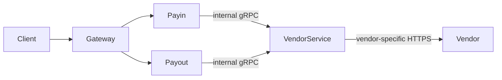
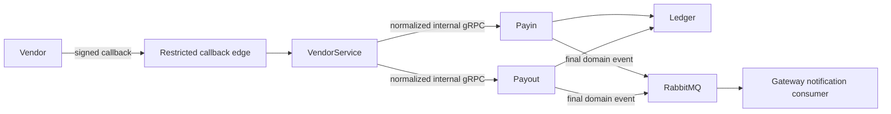

# 54 — VendorService Boundary and Trusted Callback Flow

> [Documentation home](../../README.md) · [Roadmap](../README.md) · [Active plans](README.md)

> **Status: Target / Todo.** Nothing in this document should be described as
> current behavior until its implementation and acceptance tests are complete.

## Why this change exists

The current runtime puts vendor adapter code inside Payin and Payout, while a
Payin callback first enters the public Gateway. That mixes two different
boundaries:

- Gateway is the front door for end-user product requests.
- Vendor connectivity is a machine-to-machine integration with different
  authentication, network allowlists, retry behavior, payloads, and incident
  risks.

This plan creates a ninth deployable service, **VendorService**, as the only
component that communicates directly with payment and payout vendors. It does
not become the owner of money or workflow state. Payin and Payout continue to
own intent correlation and every business-state transition.

## Locked architecture

### Outbound requests

### Inbound callbacks

The callback endpoint is restricted-public when it uses an internet address
plus source-IP allowlisting. It is genuinely private only when a vendor and
deployment support VPN, peering, or a private-link product. HMAC or vendor
mTLS remains mandatory in either case; an IP address alone is not identity.

## Service ownership

### VendorService owns

- Vendor API clients, callback decoders, signing secrets, certificate material,
  timeouts, and vendor-specific error mapping.
- Public callback routes `POST /callbacks/payin/{vendor}` and
  `POST /callbacks/payout/{vendor}` on a listener separate from admin and
  internal APIs.
- Request body limits, source-CIDR policy, trusted-proxy handling, signature
  verification, replay detection, and raw callback inbox records.
- Durable audit records for outbound calls and delivery attempts from its
  inbox to Payin or Payout.
- Transport-level health and circuit-breaker evidence for each vendor.

### Payin owns

- Top-up intents and the relationship between a vendor reference and a Seev
  user.
- Validation of expected vendor, reference, state, amount, currency, and
  expiry policy.
- Fraud screening, Ledger posting, final top-up status, reconciliation state,
  and the final `payin.topup.settled.v1` event.

Payin must remove the compatibility fallback that credits `user_id` supplied
by an unmatched vendor callback. A vendor payload can never choose the Seev
user who receives money.

### Payout owns

- Withdrawal request, selected vendor, hold, submission state, and terminal
  settle/cancel transitions.
- Correlation using its request idempotency key plus the vendor reference.
- The decision to settle a hold after a confirmed success or cancel it after a
  confirmed terminal failure.
- Final payout domain events.

Callback, polling, recovery, and synchronous vendor responses must all enter
the same guarded state-transition functions. None may create a second path
around Ledger's close guard.

### Ledger and Gateway own

- Ledger remains the only service that posts a balance-affecting transaction.
- Gateway continues to own end-user HTTP composition and notification
  delivery, but no longer exposes a vendor callback route.
- User notifications are created from final Payin/Payout domain events, not
  from a generic Ledger event that can race with unfinished domain state.

## Internal contracts

Add a versioned VendorService gRPC API with these logical operations:

- `CreatePayinSession`: called by Payin with the selected vendor and an
  internal intent identifier; returns vendor-facing instructions and
  reference data without changing Payin state itself.
- `SubmitPayout`: called by Payout with the selected vendor, immutable request
  idempotency key, amount, currency, and destination; returns accepted,
  pending, settled, failed, or uncertain.
- `QueryPayout`: asks the same vendor for an authoritative update after an
  uncertain or pending submission.

Extend Payin and Payout internal APIs with callback-delivery operations. The
normalized request contains vendor, vendor event id, external reference,
amount, currency, normalized status, event occurrence time, VendorService
inbox id, and request id. It contains no authoritative Seev `user_id`.

Normalized Payin statuses are `pending`, `settled`, and `failed`. Normalized
Payout statuses are `pending`, `settled`, and `failed`. Unknown vendor-specific
states are stored for investigation and must not change money or terminal
state.

## Callback transaction and acknowledgement rules

1. The edge rejects an oversized body or disallowed source before application
   processing.
2. VendorService preserves the exact raw body and selected headers, verifies
   the vendor signature, normalizes the payload, and inserts an inbox row with
   unique `(vendor, vendor_event_id)`.
3. VendorService calls the owning Payin or Payout service synchronously over
   mTLS gRPC.
4. The owner correlates and validates its intent/request before returning an
   accepted result.
5. VendorService returns HTTP 2xx only after the owner reports one of:
   finalized, already finalized, ignored non-terminal, or durably recorded as
   unmatched. Temporary dependency failures return a retryable response.
6. Duplicate callback delivery returns the stored outcome and never repeats a
   Ledger operation.

A valid but unmatched callback is durably stored, acknowledged, alerted, and
made available for reconciliation. It never credits or debits a user. An
expired Payin intent follows the same suspense path unless an operator uses a
separate audited reconciliation action.

## Persistence and finalization

VendorService receives its own database with:

- callback inbox rows containing encrypted or access-restricted raw payloads,
  normalized correlation fields, processing status, attempts, and outcome;
- outbound request attempts and sanitized responses;
- vendor connection configuration references, without storing plaintext
  secrets in ordinary business tables.

Payin gains a local domain outbox. After Ledger confirms an idempotent posting,
Payin commits webhook status, intent status, settlement transaction id, and the
domain outbox row in one local database transaction. If Ledger succeeds but
the local commit fails, the intent enters or remains `finalizing`; a reconciler
proves the Ledger result using the stable idempotency/external reference and
finishes the local transaction exactly once.

Payout uses the same final-event principle while retaining its existing
durable outbound command model and guarded hold-close operations. A
callback-versus-polling race must converge on one terminal state and one domain
event.

## Network and secret policy

- Production ingress applies vendor CIDR allowlists at the load balancer or
  firewall and again in VendorService as defense in depth.
- VendorService trusts `X-Forwarded-For` only when the socket peer is inside
  configured trusted-proxy CIDRs; otherwise it uses the socket address.
- Production startup fails closed when an enabled vendor lacks a callback
  authentication method or allowed ingress policy. Local development allows
  loopback and mock-vendor credentials only.
- Internal VendorService calls use the existing mTLS identity model and
  explicit caller allowlists: Payin/Payout may call outbound operations;
  VendorService may call only their callback operations.
- Logs and metrics never include raw secrets, signatures, full payloads,
  user identifiers, references, or source IPs as metric labels.

## Migration sequence

1. Introduce VendorService contracts, identity, database, health endpoints,
   metrics, Compose wiring, and mock adapters while existing traffic remains
   unchanged.
2. Move outbound payout/provider calls and Payin vendor-session calls behind
   VendorService; preserve stable idempotency keys and routing ownership.
3. Add callback inbox and internal Payin/Payout delivery, then run both new
   callback flows with mock vendors in tests.
4. Switch test and local callback URLs to VendorService.
5. Remove `/webhooks/{vendor}` and its callback middleware from Gateway in the
   same release; this reference repository has no production compatibility
   window. Do not retain a permanent fallback path.
6. Remove in-process vendor adapters and secrets from Payin/Payout after all
   callers use VendorService.
7. Update current-state documentation from eight to nine services only after
   the final acceptance gate passes.

## Verification and acceptance

- Unit tests cover source-CIDR and trusted-proxy parsing, body caps, signature
  verification before parsing, unknown vendors, normalization, duplicate
  event ids, and sanitized logging.
- Payin tests prove wrong vendor/reference/amount/currency, missing intent, and
  expired intent never post Ledger money or notify a user.
- Failure injection proves that Ledger success followed by a Payin commit
  failure emits no notification until reconciliation completes finalization.
- Payout tests cover pending/settled/failed callbacks, duplicates,
  out-of-order updates, callback-versus-polling races, and settle-versus-cancel
  races without double payout.
- Integration tests trace vendor → VendorService → Payin/Payout → Ledger →
  domain outbox → RabbitMQ → notification and prove the old Gateway callback
  route is absent.
- Chaos tests cover VendorService restart, owner-service outage, RabbitMQ
  outage, repeated callbacks, and a lost HTTP response after successful
  processing.
- Metrics and alerts expose denied callback requests, unmatched callbacks,
  callback processing outcomes, inbox retry age, finalizing backlog, domain
  outbox lag, and dead deliveries by flow and vendor.

The plan is complete when vendors have no direct route to Gateway, Payin, or
Payout; Payin/Payout never trust vendor-supplied user ownership; every terminal
state and user notification is emitted exactly once from an owner-domain
event; and the full race, integration, business, and chaos suites pass.
