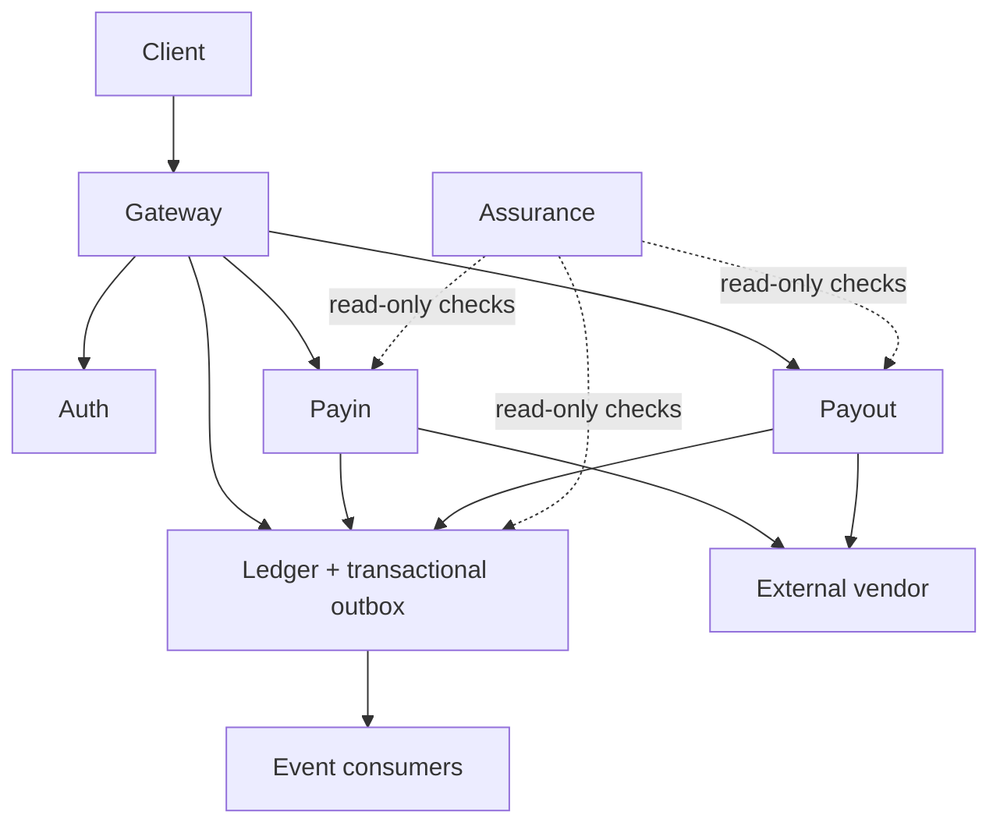

# Detailed Plan — Five-Minute Engineering Route

## 1. Objective

Membuat jalur evaluasi singkat yang memungkinkan recruiter, hiring manager, dan engineering reviewer memahami kualitas teknis Seev dalam waktu sekitar lima menit.

Halaman utama yang akan dibuat:

```text
docs/portfolio/engineering-proof.md
```

Judul halaman:

```markdown
# Evaluate Seev in Five Minutes
```

Halaman ini bukan pengganti README, product tour, engineering route, atau traceability map. Fungsinya adalah menjadi **curated evidence index** untuk membantu reviewer menjawab satu pertanyaan:

> Apakah pemilik repository memahami financial correctness, bukan hanya mampu membuat API?

---

## 2. Why This Has High ROI

README Seev sudah sangat lengkap, tetapi reviewer dapat merasa kewalahan karena repository memiliki:

- Sembilan service.
- Banyak kategori dokumentasi.
- Puluhan implementation plan.
- Interactive story dengan ratusan panel.
- Banyak command, scenario, dan learning journey.

Engineer yang serius mungkin bersedia menjelajah lebih jauh, tetapi recruiter atau hiring manager belum tentu mempunyai cukup waktu.

Dengan satu halaman ringkas, reviewer dapat langsung melihat:

1. Problem engineering yang sulit.
2. Arsitektur tingkat tinggi.
3. Financial invariants.
4. Executable proof.
5. Measured evidence dan known limitations.

---

## 3. Role of Each Documentation Entry Point

| Document | Main question answered |
|---|---|
| Root README | Apa itu Seev? |
| Product tour | Bagaimana produk bekerja? |
| Engineering route | Bagaimana engineer menjelajahi implementasinya? |
| Traceability map | Di mana seluruh klaim dibuktikan? |
| **Engineering proof** | **Apakah financial-correctness claims Seev dapat dipercaya?** |

`engineering-proof.md` harus menjadi lapisan kurasi di atas bukti yang sudah ada, bukan mengulang seluruh dokumentasi repository.

---

## 4. Scope and Constraints

Target akhir halaman:

- Sekitar 350–550 kata.
- Maksimal lima section utama.
- Satu diagram arsitektur.
- Maksimal sembilan kotak pada diagram.
- Tepat tiga financial invariants.
- Tepat tiga executable proofs.
- Tepat empat measured-evidence links.
- Tidak berisi tutorial setup.
- Tidak berisi daftar seluruh service.
- Tidak berisi roadmap panjang.
- Tidak berisi tabel command.
- Tidak menggunakan klaim seperti “production-ready” tanpa bukti.

Halaman harus dapat dipahami tanpa membuka link lain terlebih dahulu. Link digunakan untuk memverifikasi klaim, bukan untuk memahami alur dasar halaman.

---

## 5. Target Page Structure

```text
# Evaluate Seev in Five Minutes

Minute 1 — Problem
Minute 2 — Architecture
Minute 3 — Three invariants
Minute 4 — Three proofs
Minute 5 — Measured evidence
```

Gunakan metadata pendek pada bagian atas:

```markdown
# Evaluate Seev in Five Minutes

> A five-minute evidence route for engineering reviewers and hiring decision-makers.
>
> Status: Current implementation and executable evidence.
```

Tidak perlu menambahkan table of contents karena halamannya singkat.

---

# 6. Minute 1 — Problem

Gunakan satu pertanyaan utama:

```markdown
## Minute 1 — Problem

How can a wallet move money exactly once across retries, crashes,
delayed callbacks, and unreliable external vendors?
```

Tambahkan maksimal satu paragraf pendukung:

```markdown
Seev treats this as a financial-correctness problem, not only an API-design
problem. A successful response is insufficient unless the resulting money
movement remains balanced, idempotent, recoverable, and auditable.
```

Tujuan section ini adalah memperjelas bahwa problem utama Seev bukan sekadar membuat payment API, tetapi memastikan state uang tetap benar ketika terjadi:

- Retry.
- Duplicate request.
- Delayed callback.
- Worker crash.
- Broker outage.
- Vendor timeout.
- Unknown payout state.

Jangan menambahkan penjelasan implementasi pada bagian ini.

---

# 7. Minute 2 — Architecture

## 7.1 Diagram Constraint

Diagram harus memiliki maksimal sembilan kotak.

Gunakan node berikut:

1. Client.
2. Gateway.
3. Auth.
4. Payin.
5. Payout.
6. External Vendor.
7. Ledger + Transactional Outbox.
8. Event Consumers.
9. Assurance.

`Ledger` dan `Transactional Outbox` digabung menjadi satu kotak agar diagram tetap sederhana.

## 7.2 Recommended Diagram



Tambahkan legenda singkat:

```markdown
Solid arrows change or deliver state; dotted arrows independently verify it.
```

## 7.3 Explicitly Excluded Details

Jangan tampilkan detail berikut pada diagram lima menit:

- Database per service.
- Redis.
- RabbitMQ.
- Fraud service.
- Admin BFF.
- Nomor port.
- HTTP versus gRPC.
- Individual workers.
- Internal package boundaries.

Detail tersebut tetap tersedia pada dokumentasi arsitektur lain.

---

# 8. Minute 3 — Three Invariants

Gunakan tiga invariant berikut secara eksplisit:

```markdown
## Minute 3 — Three invariants

1. **Every posting balances.**
2. **One business operation changes money once.**
3. **Corrections append compensating history.**
```

Tambahkan satu penjelasan singkat untuk setiap invariant.

## 8.1 Every Posting Balances

```markdown
For every committed transaction, total debits equal total credits.
```

Makna:

- Tidak boleh ada uang muncul tanpa sumber.
- Tidak boleh ada uang hilang tanpa tujuan.
- Setiap financial posting harus memenuhi double-entry balance.

## 8.2 One Business Operation Changes Money Once

```markdown
Retries, duplicate callbacks, and concurrent requests may repeat delivery,
but they must not repeat the monetary effect.
```

Makna:

- Request dapat dikirim ulang.
- Callback dapat datang berkali-kali.
- Worker dapat memproses ulang.
- Monetary effect tetap hanya boleh terjadi sekali.

## 8.3 Corrections Append Compensating History

```markdown
Posted financial history is not rewritten to hide mistakes; corrections
are represented by new, attributable compensating entries.
```

Makna:

- Financial history tidak dihapus atau ditimpa.
- Correction dilakukan dengan append-only compensating entry.
- Audit trail tetap dapat direkonstruksi.

Minute 3 harus menjelaskan rules. Detail implementasi dan pembuktiannya ditempatkan pada Minute 4.

---

# 9. Minute 4 — Three Proofs

Setiap proof harus mempunyai:

- Judul yang dapat dipahami reviewer.
- Klaim yang dibuktikan.
- Link langsung ke test atau chaos scenario.
- Nama test atau scenario.
- Penjelasan maksimal dua kalimat.

Jangan menautkan primary proof ke roadmap atau design plan. Proof harus berasal dari executable test atau scenario.

---

## 9.1 Proof 1 — Concurrent Duplicate Request

### Target

```text
internal/ledger/idempotency_digest_integration_test.go
```

### Expected Test

```text
TestIdempotency_ConcurrentRetries_ExactlyOneMonetaryEffect
```

### Claim

Beberapa request identik menggunakan business idempotency key yang sama secara concurrent, tetapi:

- Balance hanya berubah satu kali.
- Satu ledger transaction tersimpan.
- Semua retry menerima hasil yang konsisten.

### Suggested Page Copy

```markdown
### 1. Concurrent duplicate request

[Twenty concurrent retries produce one monetary effect](...)

Twenty identical requests use the same business key. The final balance changes
once and exactly one ledger transaction is stored.
```

### Verification Checklist

- Pastikan test masih aktif dan tidak di-skip.
- Pastikan assertion memeriksa final balance.
- Pastikan assertion memeriksa jumlah ledger transaction.
- Pastikan test benar-benar concurrent, bukan sequential retry.
- Gunakan GitHub link dengan line range bila line stabil.
- Tetap tuliskan nama fungsi agar reviewer dapat mencarinya jika line berubah.

---

## 9.2 Proof 2 — Broker Outage Recovery

### Target

```text
scripts/chaos-test.sh
```

### Expected Scenario

```text
scenario_2
```

### Expected Behavior

Scenario harus membuktikan urutan berikut:

1. RabbitMQ dihentikan.
2. Transfer tetap dikirim.
3. Financial posting tetap berhasil karena ledger dan outbox tersimpan secara durable.
4. RabbitMQ dinyalakan kembali.
5. Outbox backlog diproses.
6. Tidak ada event yang berakhir sebagai dead event.
7. Downstream consumer akhirnya menerima event.
8. Ledger dan projection tetap konsisten.

### Suggested Page Copy

```markdown
### 2. Broker outage recovery

[Transactions survive a broker outage and publish after recovery](...)

Money posting remains available while RabbitMQ is unavailable. After the broker
returns, the outbox drains without dead events and downstream delivery resumes.
```

### Verification Checklist

- Pastikan posting benar-benar terjadi ketika broker mati.
- Pastikan transaction commit tidak bergantung pada broker availability.
- Pastikan outbox pending meningkat selama outage.
- Pastikan backlog kembali turun setelah broker pulih.
- Pastikan dead event tetap nol.
- Pastikan downstream projection atau notification akhirnya konsisten.

---

## 9.3 Proof 3 — Payout Unknown-State Recovery

### Preferred Target

```text
scripts/chaos-test.sh
```

### Preferred Scenario

```text
scenario_8
```

Scenario ini lebih cocok daripada general worker-crash scenario karena membuktikan reasoning penting:

> Timeout does not prove that the vendor rejected the payout.

### Expected Behavior

- Payout yang belum pernah dikirim boleh diarahkan ke healthy vendor.
- Payout yang sudah dikirim tetapi hasilnya uncertain tidak boleh dialihkan ke vendor lain.
- Payout tetap pinned ke vendor awal.
- Retry dilakukan ke vendor yang sama.
- Tidak boleh terjadi double settlement.

### Suggested Page Copy

```markdown
### 3. Payout unknown-state recovery

[An uncertain payout remains pinned and settles at most once](...)

A timeout does not prove that the vendor rejected the payout. Seev keeps the
in-flight operation pinned to the original vendor and prevents a second settlement.
```

### Verification Checklist

- Pastikan scenario benar-benar menghasilkan vendor timeout atau uncertain result.
- Pastikan request sudah dianggap submitted sebelum timeout.
- Pastikan routing tidak berpindah ke vendor lain.
- Pastikan retry tetap ke vendor awal.
- Pastikan settlement hanya terjadi satu kali.
- Pastikan ledger tetap balanced.

---

# 10. Minute 5 — Measured Evidence

Gunakan tepat empat link:

```markdown
## Minute 5 — Measured evidence

- [Preliminary local benchmark — bounded evidence, not a production-capacity claim](...)
- [Money-flow observability during broker recovery](...)
- [Payout unknown-state recovery timeline](...)
- [Known limitations and claims Seev deliberately does not make](...)
```

---

## 10.1 Benchmark Report

### Target

```text
docs/performance/reports/2026-07-baseline.md
```

### Positioning

Jangan menyebut hasil benchmark sebagai production capacity proof.

Gunakan label:

```markdown
Preliminary local benchmark — bounded evidence, not a production-capacity claim
```

Benchmark report harus menjelaskan:

- CPU.
- Memory.
- Docker version.
- PostgreSQL version.
- Go version.
- Commit hash.
- Dataset size.
- Jumlah akun.
- Jumlah transaksi awal.
- Scenario yang dijalankan.
- Throughput.
- p50, p95, dan p99 latency.
- Error rate.
- Outbox lag.
- Connection-pool saturation.
- Lock waits.
- Limitasi hasil.

Jangan memindahkan seluruh angka benchmark ke halaman lima menit. Reviewer cukup mendapatkan link beserta qualification yang jujur.

---

## 10.2 Observability Screenshot

### New Asset

```text
docs/portfolio/assets/money-flow-recovery.png
```

### Recommended Capture Scenario

Gunakan broker-outage recovery scenario.

Screenshot ideal memperlihatkan dalam satu layar:

- Posting success or error rate.
- Outbox pending backlog meningkat.
- Waktu broker pulih.
- Outbox backlog turun kembali.
- Dead event tetap nol.
- Ledger imbalance tetap nol, jika tersedia.

### Required Metadata

Tambahkan caption atau metadata:

```text
Scenario: broker outage recovery
Commit: <short-sha>
Environment: local-small
Captured: <UTC timestamp>
```

### Security Checklist

Sebelum commit screenshot:

- Redact token.
- Redact account number.
- Redact destination identifier.
- Redact credential.
- Redact internal hostname bila sensitif.
- Pastikan gambar tetap terbaca pada GitHub preview.

Jangan menggunakan dashboard kosong atau happy-path screenshot. Nilai utama screenshot adalah menunjukkan failure dan recovery.

---

## 10.3 Failure Timeline

### New Asset

```text
docs/portfolio/assets/payout-unknown-state-timeline.svg
```

### Expected Timeline

```text
T+0s     Payout created
T+Xs     Funds held
T+Xs     Vendor submission persisted
T+Xs     Vendor call times out
T+Xs     Outcome marked uncertain
T+Xs     No cross-vendor failover permitted
T+Xs     Retry sent to the same vendor
T+Xs     One settlement posted
T+Xs     Ledger remains balanced
```

Timeline harus berasal dari actual scenario run, bukan hanya ilustrasi teoretis.

Gunakan timestamp aktual bila tersedia. Jika instrumentation belum cukup:

1. Tambahkan structured logging pada chaos harness.
2. Gunakan correlation ID atau payout ID.
3. Capture event timestamps.
4. Susun timeline berdasarkan log tersebut.

SVG lebih direkomendasikan karena ringan, tajam, dan mudah dilihat langsung di GitHub.

---

## 10.4 Known Limitations

Link harus mengarah ke section yang secara eksplisit menjelaskan:

- Seev merupakan educational atau reference implementation.
- Seev bukan hosted payment product.
- Preliminary benchmark bukan production-capacity guarantee.
- Beberapa feature atau operational proof masih berada dalam roadmap.
- Ada klaim yang sengaja tidak dibuat oleh repository.

Gunakan label:

```markdown
Known limitations and claims Seev deliberately does not make
```

Known limitations harus terlihat sebagai tanda engineering judgment, bukan disclaimer yang disembunyikan.

---

# 11. Recommended Final Page Skeleton

```markdown
# Evaluate Seev in Five Minutes

> A five-minute evidence route for engineering reviewers and hiring decision-makers.
>
> Status: Current implementation and executable evidence.

## Minute 1 — Problem

How can a wallet move money exactly once across retries, crashes,
delayed callbacks, and unreliable external vendors?

Seev treats this as a financial-correctness problem, not only an API-design
problem. A successful response is insufficient unless the resulting money
movement remains balanced, idempotent, recoverable, and auditable.

## Minute 2 — Architecture

<nine-box Mermaid diagram>

Solid arrows change or deliver state; dotted arrows independently verify it.

## Minute 3 — Three invariants

1. **Every posting balances.**
2. **One business operation changes money once.**
3. **Corrections append compensating history.**

## Minute 4 — Three proofs

### 1. Concurrent duplicate request

[Twenty concurrent retries produce one monetary effect](...)

Twenty identical requests use the same business key. The final balance changes
once and exactly one ledger transaction is stored.

### 2. Broker outage recovery

[Transactions survive a broker outage and publish after recovery](...)

Money posting remains available while RabbitMQ is unavailable. After recovery,
the outbox drains and downstream delivery resumes.

### 3. Payout unknown-state recovery

[An uncertain payout remains pinned and settles at most once](...)

A timeout does not prove vendor rejection. The in-flight operation remains
pinned to the original vendor and cannot produce a second settlement.

## Minute 5 — Measured evidence

- [Preliminary local benchmark — not a production-capacity claim](...)
- [Money-flow observability during broker recovery](...)
- [Payout unknown-state recovery timeline](...)
- [Known limitations and claims Seev deliberately does not make](...)
```

---

# 12. Repository Navigation Changes

## 12.1 Root README

Pada section seperti:

```markdown
## Choose only one next step
```

Tambahkan route:

```markdown
| Evaluate the engineering evidence in five minutes | [Engineering proof](docs/portfolio/engineering-proof.md) |
```

Recommended order:

1. Evaluate engineering evidence in five minutes.
2. Choose an interactive story chapter.
3. Understand the current product.
4. Run Seev locally.
5. Change or review Seev.
6. Operate or troubleshoot Seev.

Route lima menit harus muncul sebelum jalur implementasi yang lebih panjang.

## 12.2 Documentation Home

Pada `docs/README.md`, tambahkan:

```markdown
| Decide whether Seev's financial-correctness claims are credible | [Evaluate Seev in Five Minutes](portfolio/engineering-proof.md) |
```

Dua entry point sudah cukup:

- Root README.
- Documentation home.

Jangan menambahkan link ini ke terlalu banyak halaman karena dapat menambah noise.

---

# 13. Planned File Changes

## Required

```text
A  docs/portfolio/engineering-proof.md
A  docs/portfolio/assets/money-flow-recovery.png
A  docs/portfolio/assets/payout-unknown-state-timeline.svg
M  README.md
M  docs/README.md
```

## Optional

```text
A  docs/portfolio/README.md
```

Buat `docs/portfolio/README.md` hanya jika convention atau documentation check mengharuskan setiap directory mempunyai index.

Contoh minimal:

```markdown
# Portfolio evidence

Start with [Evaluate Seev in Five Minutes](engineering-proof.md).
```

---

# 14. Implementation Phases

## Phase 1 — Lock the Claims

Tujuan: memastikan setiap klaim memiliki bukti executable yang valid.

Tasks:

1. Tentukan exact test function untuk concurrent duplicate request.
2. Tentukan exact chaos scenario untuk broker outage.
3. Tentukan exact chaos scenario untuk payout unknown state.
4. Jalankan ketiga proof.
5. Pastikan seluruh proof hijau.
6. Pastikan proof berada pada current implementation, bukan archived plan.
7. Catat commit SHA yang digunakan.
8. Catat direct GitHub path dan line range.

Output:

```text
proof-1 -> concurrent idempotency integration test
proof-2 -> broker outage chaos scenario
proof-3 -> uncertain payout vendor-pinning scenario
```

Definition of done:

- Semua proof executable.
- Tidak ada proof yang hanya berupa documentation claim.
- Nama test dan scenario final sudah dikunci.

---

## Phase 2 — Produce Missing Runtime Evidence

Tujuan: menghasilkan visual evidence yang dapat dipercaya.

Tasks:

1. Jalankan broker-outage scenario.
2. Buka Grafana dashboard yang relevan.
3. Capture kondisi sebelum outage, selama outage, dan recovery dalam satu screenshot bila memungkinkan.
4. Jalankan uncertain-payout scenario.
5. Ambil event timestamp dari log.
6. Susun SVG timeline.
7. Tambahkan commit SHA dan environment metadata.
8. Redact sensitive data.

Definition of done:

- Screenshot memperlihatkan failure dan recovery.
- Timeline berasal dari actual run.
- Tidak ada secret atau personal data.
- Asset dapat dirender langsung di GitHub.

---

## Phase 3 — Write the Main Page

Tujuan: membuat halaman singkat yang fokus pada decision-making.

Tasks:

1. Tulis Minute 1 sampai Minute 5.
2. Tambahkan nine-box Mermaid diagram.
3. Masukkan tepat tiga invariants.
4. Masukkan tepat tiga direct proof links.
5. Masukkan tepat empat evidence links.
6. Tambahkan status dan qualification pada benchmark.
7. Tambahkan known limitations link.
8. Kurangi isi sampai maksimal sekitar 550 kata.

Editing pass:

- Hapus setup instructions.
- Hapus daftar service.
- Hapus historical explanation.
- Hapus command panjang.
- Hapus adjective tanpa bukti.
- Ganti self-claim dengan link evidence.

Guiding principle:

```text
Do not say it is reliable.
Show the failure and the recovered invariant.
```

Definition of done:

- Halaman dapat dibaca dalam sekitar lima menit.
- Klaim utama dapat diverifikasi satu klik.
- Tidak memerlukan pemahaman seluruh repository.

---

## Phase 4 — Add Navigation

Tujuan: memastikan halaman dapat ditemukan dengan cepat.

Tasks:

1. Tambahkan route pada root README.
2. Tambahkan route pada `docs/README.md`.
3. Pastikan route berada dekat bagian awal documentation navigation.
4. Gunakan wording yang berorientasi pada keputusan reviewer.

Definition of done:

- Halaman dapat ditemukan dalam satu klik dari root README.
- Halaman dapat ditemukan dalam satu klik dari docs home.

---

## Phase 5 — Verification and Polish

Tujuan: memastikan link, diagram, asset, dan klaim valid.

Tasks:

1. Jalankan documentation validation.
2. Verifikasi Mermaid tampil pada GitHub.
3. Verifikasi seluruh relative link.
4. Verifikasi direct proof link membuka test atau scenario yang tepat.
5. Verifikasi PNG dan SVG tampil tanpa authentication.
6. Verifikasi tidak ada secret pada screenshot.
7. Verifikasi halaman nyaman dibaca pada mobile-width viewport.
8. Verifikasi benchmark tidak dipresentasikan sebagai production capacity.
9. Verifikasi target architecture tidak disajikan sebagai current implementation.
10. Minta satu reviewer yang belum memahami repo membaca halaman selama lima menit.

Recommended command:

```bash
make docs-check
```

Tambahkan link checker khusus jika `docs-check` belum memvalidasi relative links.

---

# 15. Acceptance Criteria

## 15.1 Discoverability

- Dapat ditemukan dalam satu klik dari root README.
- Dapat ditemukan dalam satu klik dari `docs/README.md`.

## 15.2 Five-Minute Constraint

- Maksimal lima section utama.
- Maksimal sembilan architecture boxes.
- Tepat tiga invariants.
- Tepat tiga executable proofs.
- Tepat empat evidence atau limitation links.
- Maksimal sekitar 550 kata di luar Mermaid.

## 15.3 Proof Quality

- Duplicate-request link membuka concurrent integration test.
- Broker-outage link membuka executable chaos scenario.
- Unknown-state link menunjukkan vendor pinning dan double-settlement prevention.
- Tidak ada roadmap yang digunakan sebagai primary evidence.
- Setiap klaim utama memiliki code, test, report, atau captured runtime evidence.

## 15.4 Evidence Quality

- Benchmark diberi label preliminary atau bounded evidence.
- Screenshot menunjukkan failure dan recovery.
- Timeline menggunakan actual event order.
- Known limitations mudah ditemukan.
- Tidak ada klaim production-readiness yang tidak didukung bukti.

## 15.5 Reviewer Outcome

Setelah membaca halaman, reviewer harus dapat menjawab:

1. Apa distributed-systems problem utama Seev?
2. Komponen mana yang menyimpan permanent money records?
3. Apa tiga financial invariants utama?
4. Bagaimana duplicate request dibuktikan aman?
5. Apa yang terjadi ketika broker mati?
6. Mengapa uncertain payout tidak boleh langsung dialihkan ke vendor lain?
7. Evidence mana yang measured?
8. Klaim apa yang belum dibuat oleh repository?

---

# 16. Recommended Priority Order

Urutan Pareto:

1. Buat `docs/portfolio/engineering-proof.md` dengan proof yang sudah tersedia.
2. Tambahkan link pada root README.
3. Tambahkan link pada documentation home.
4. Capture satu observability screenshot yang kuat.
5. Buat satu unknown-state failure timeline.
6. Rapikan line-level links.
7. Tambahkan automation atau CI link validation bila diperlukan.

Dua langkah pertama sudah memberikan sebagian besar manfaat packaging. Screenshot dan timeline kemudian meningkatkan kredibilitas dari documentation index menjadi engineering evidence package.

---

# 17. Risks and Mitigations

| Risk | Impact | Mitigation |
|---|---|---|
| Halaman terlalu panjang | Reviewer kembali merasa kewalahan | Batasi 550 kata dan lima section |
| Link mengarah ke plan, bukan proof | Klaim terlihat lemah | Gunakan executable test atau chaos scenario |
| GitHub line number berubah | Direct link menjadi kurang presisi | Tulis juga nama fungsi atau scenario |
| Benchmark terlihat seperti production claim | Menurunkan kredibilitas | Gunakan qualification dan environment metadata |
| Screenshot hanya menunjukkan healthy state | Tidak membuktikan recovery | Capture backlog naik dan turun saat failure |
| Timeline hanya ilustrasi | Bukti terlihat teoritis | Gunakan actual event timestamps |
| Diagram terlalu detail | Menghabiskan waktu reviewer | Maksimal sembilan node |
| Known limitations disembunyikan | Terlihat seperti marketing | Tampilkan pada Minute 5 |
| Halaman cepat stale | Link atau claim tidak lagi valid | Tambahkan docs check dan review saat proof berubah |

---

# 18. Optional CI Follow-Up

Setelah halaman utama selesai, pertimbangkan validation ringan:

- Check bahwa `engineering-proof.md` ada.
- Check relative links tidak rusak.
- Check target proof files masih ada.
- Check image assets masih tersedia.
- Check Mermaid block valid secara syntax.
- Check page tidak melebihi batas ukuran yang disepakati.

CI ini bukan blocker untuk implementasi awal, tetapi berguna agar halaman tidak menjadi stale setelah repository berkembang.

---

# 19. Final Success Statement

Halaman ini dianggap berhasil apabila reviewer tidak lagi menyimpulkan hanya:

> Seev mempunyai banyak service dan fitur.

Tetapi dapat menyimpulkan:

> The author defines financial invariants, creates realistic failure modes,
> proves recovery behavior, measures the system, and states the limits of the evidence.
